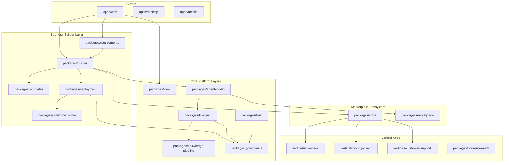

# AI Pass

[](https://github.com/aebada/AI-Pass/actions/workflows/ci.yml)
[](./LICENSE)
[](./CONTRIBUTING.md)

**AI Pass is an open-source business solution platform — not just an AI IDE.**

AI Pass helps **business users** describe requirements in natural language and generate web apps, mobile apps, workflows, and AI agents — with governance, trust, and marketplace distribution built in. Developers get a full AI workspace with Monaco editor, agents, and terminal in the same platform.

**Live site:** [aipass.space](https://aipass.space) · **Contribute:** [CONTRIBUTING.md](./CONTRIBUTING.md) · **Security:** [SECURITY.md](./SECURITY.md)

**Docs:** [Testing & CI](docs/testing.md) · [QA process](docs/qa-process.md) · [Claims source](docs/claims-source.md) · [Open source checklist](docs/OPEN-SOURCE.md) · [On-prem packaging plan](docs/on-prem-packaging-plan.md)

## Platform capabilities

| Capability | AI Pass |
|------------|---------|
| Primary user | Business users + developers |
| Entry point | Requirements wizard + visual studio + AI workspace |
| App generation | One-click web + mobile scaffolds |
| Workflows & agents | Visual canvas with agent assignment |
| Governance | Approval workflows, audit trail, RBAC |
| Marketplace | Vertical solutions (Invoice, Support, Supply Chain) |
| Deploy | Built-in deployment with trust certification |

## Platform Architecture



## Dual Mode

| Mode | Route | User |
|------|-------|------|
| **Business Builder** | `/`, `/studio`, `/requirements` | Non-technical users |
| **AI Pass Platform** | `/ide` | All teams (full AI development workspace) |
| **Platform Admin** | `/platform` | IT / governance teams |

## Project Structure

```
ai-pass/
├── apps/
│   ├── web/
│   │   └── app/
│   │       ├── page.tsx           # Business landing
│   │       ├── ide/               # AI Pass Platform workspace (Monaco, route /ide)
│   │       ├── studio/            # Solution Builder Studio
│   │       ├── requirements/      # Requirements wizard
│   │       ├── solutions/         # My Solutions dashboard
│   │       └── marketplace/       # Solution marketplace
│   ├── desktop/
│   └── mobile/
├── packages/
│   ├── requirements/              # NL → structured spec
│   ├── builder/                   # Requirements → solution compiler
│   ├── templates/                 # Web, mobile, workflow templates
│   ├── solution-runtime/          # Generated app runtime
│   ├── deployment/                # One-click deploy + governance
│   ├── view/                      # Unified navigation
│   ├── agent-studio/              # Agent wizard & execution
│   ├── store/                     # AI Pass Store
│   ├── marketplace/               # Skills marketplace
│   ├── governance/                # Policies & approvals
│   ├── trust/                     # Certification engine
│   ├── livesync/                  # Real-time orchestration
│   ├── knowledge-pipeline/        # RAG & knowledge sync
│   └── verticals/                 # Invoice, Support, Supply Chain
```

## Documentation

Technical docs live under **[docs/](docs/README.md)** (concepts, architecture, data model, local development, Hostinger deploy, Invoice AI, auth).

| Start here | |
|------------|---|
| [docs/CONCEPTS.md](docs/CONCEPTS.md) | Product & tech concepts, glossary |
| [docs/ARCHITECTURE.md](docs/ARCHITECTURE.md) | Monorepo, static web + Laravel auth, tenants |
| [docs/DATA-MODEL.md](docs/DATA-MODEL.md) | Entities, statuses, localStorage keys |
| [docs/DEVELOPMENT.md](docs/DEVELOPMENT.md) | Node 22 / pnpm setup and pitfalls |
| [docs/DEPLOYMENT.md](docs/DEPLOYMENT.md) | Production FTP + Laravel auth |
| [docs/INVOICE-AI.md](docs/INVOICE-AI.md) | Invoice AI subsystem |

## Prerequisites

- Node.js 20+ (**22 preferred** for static production builds)
- pnpm 9+

## Setup & Build

```bash
pnpm install
pnpm build
pnpm typecheck
```

## Development

```bash
pnpm dev:web
```

See [docs/DEVELOPMENT.md](docs/DEVELOPMENT.md) for Laravel auth locally, package tests, and external-volume install tips.

| URL | Purpose |
|-----|---------|
| http://localhost:3000 | Business landing |
| http://localhost:3000/requirements | Requirements wizard |
| http://localhost:3000/studio | Solution Builder Studio |
| http://localhost:3000/solutions | My Solutions |
| http://localhost:3000/marketplace | Solution marketplace |
| http://localhost:3000/ide | AI Pass Platform (full AI development workspace) |
| http://localhost:3000/platform | Platform admin dashboard |

## Platform IDE capabilities

AI Pass `/ide` delivers a full AI development workspace integrated with business platform routes.

| Feature | AI Pass Platform | Status |
|---------|------------------|--------|
| Monaco multi-tab editor | ✅ | Working |
| Syntax highlighting & themes | ✅ | Working (dark/light) |
| File explorer | ✅ | Working (sample project; desktop open-folder stub) |
| Search in files | ✅ | Working via command palette |
| Git status indicators | ✅ | Demo indicators |
| Integrated terminal | ✅ | xterm.js (web); native stub (desktop) |
| Command palette (⌘K / ⌘⇧P) | ✅ | Working |
| Status bar | ✅ | Working |
| Chat panel + streaming | ✅ | Working with API key |
| Agent mode (tool loop) | ✅ | Working via `@ai-pass/agent` |
| Composer (multi-file) | ✅ | Working via agent package |
| Inline completion | ✅ | Stub + real API when key set |
| @ mentions | ✅ | Working (@file, @codebase, @docs, @folder) |
| Rules (project conventions) | ✅ | localStorage + Settings editor |
| Skills | 🔶 | Schema ready; UI stub |
| MCP servers | 🔶 | Package exists; IDE wiring stub |
| Business Studio integration | ✅ | Sidebar + title bar links |

**Stubbed / next:** real filesystem on web (File System Access API), native terminal in Electron, MCP panel, skills browser, codebase indexing UI.

### Using the IDE

```bash
pnpm dev:web
# Open http://localhost:3000/ide
```

1. **Explorer** — click files in the sidebar to open tabs in Monaco.
2. **Chat / Agent / Composer** — use the right panel mode tabs. Add an API key in Settings → Models.
3. **Command palette** — `⌘K` or `⌘⇧P` to search files, run commands, or navigate to Studio/Marketplace.
4. **@ mentions** — type `@` in chat for `@file`, `@codebase`, `@docs`, or specific files.
5. **Rules** — Settings → Rules tab, or stored in `localStorage` under `ai-pass-rules`.
6. **Business features** — Sidebar → Business tab, or title bar links to Studio, Marketplace, Requirements.

Desktop (local IPC): `pnpm dev:desktop` loads `http://localhost:3000/ide` with Electron IPC for `openFolder`, `readFile`, `writeFile`.

**AI-Pass IDE** (downloadable shell → live `aipass.space`): `pnpm --filter @ai-pass/ide start` — see [docs/IDE.md](docs/IDE.md) and [/downloads](apps/web/app/downloads/).

## Business User Journey (5 Steps)

1. **Describe** — Open `/requirements`, enter business need in plain language
2. **Review** — AI Pass parses actors, workflows, data entities, screens, integrations
3. **Design** — Open `/studio` to assign agents, preview web + mobile layouts
4. **Deploy** — One-click deploy with governance approval (high-risk solutions)
5. **Manage** — View deployed solutions in `/solutions`, customize from marketplace

## Module Map

| Document | Package / Route | Status |
|----------|-----------------|--------|
| Business Builder Layer | `packages/requirements`, `packages/builder` | Implemented |
| Requirements Wizard | `/requirements` | Working |
| Solution Studio | `/studio` | Working |
| One-Click Deploy | `packages/deployment` | Scaffold (governance wired) |
| My Solutions | `/solutions` | Working (localStorage) |
| Solution Marketplace | `/marketplace` | Working |
| AI.docx (Platform OS) | `packages/view` | Implemented |
| Agent Studio | `packages/agent-studio` | Implemented |
| Store / Marketplace | `packages/store`, `packages/marketplace` | Implemented |
| Governance / Trust | `packages/governance`, `packages/trust` | Implemented |
| Verticals | `packages/verticals` | Implemented |

## Production deploy (aipass.space)

**Live site:** [https://aipass.space](https://aipass.space)

Full guide: **[docs/DEPLOYMENT.md](docs/DEPLOYMENT.md)**.

Google Sign-In on Hostinger shared hosting uses **Laravel sessions** (`services/auth-api`). See **[docs/LARAVEL-AUTH.md](docs/LARAVEL-AUTH.md)**. Legacy PHP auth: [docs/PHP-AUTH.md](docs/PHP-AUTH.md). Node/NextAuth for VPS: [docs/AUTH.md](docs/AUTH.md).

| Route | Page |
|-------|------|
| `/` | Business landing |
| `/requirements` | Requirements wizard |
| `/studio` | Solution Builder Studio |
| `/solutions` | My Solutions |
| `/marketplace` | Solution marketplace |
| `/ide` | AI Pass Platform |
| `/platform` | Platform admin dashboard |
| `/downloads` | Download page |
| `/settings` | Settings & profile |

Static export is uploaded to Hostinger shared hosting via FTP. The FTP account docroot (`/`) serves `aipass.space` (not the `u234903558.aipass.space` preview subdomain).

```bash
export FTP_HOST=92.113.19.130
export FTP_USER='u234903558.aipass'
export FTP_PASS='your-ftp-password'   # never commit; use env or a local-only secret store
export FTP_REMOTE_DIR=/

./scripts/build-web-static.sh
./scripts/deploy-ftp.sh
```

`.htaccess` from `apps/web/public/` is always copied into `apps/web/out/` after build (Next.js does not copy dotfiles). The deploy script uses `lftp mirror -a` so `.htaccess` is uploaded. Without it, only `/` and `/*.html` URLs work on Apache.

**Static hosting limits:** API routes under `app/api/` are excluded from the static export. AI chat, LiveSync, and server-side features run in demo/local mode (localStorage, client-side stubs). For full backend features, run `pnpm dev:web` or deploy to a Node host.

### DNS (if the domain does not load)

Point the apex domain at Hostinger:

| Type | Name | Value |
|------|------|-------|
| A | `@` | Hostinger CDN / parking A records from hPanel (FTP host may still be `92.113.19.130`) |
| A / CNAME | `www` | Hostinger-provided target (often `www.aipass.space.cdn.hstgr.net`) |

Use Hostinger nameservers if the registrar still shows parking NS (`dns-parking.com`). DNS changes can take up to 24–48 hours.

## Contributing

AI Pass is open source and contributions are welcome.

1. Read [CONTRIBUTING.md](./CONTRIBUTING.md)
2. Follow the [Code of Conduct](./CODE_OF_CONDUCT.md)
3. Open an issue (bug / feature templates) or a pull request
4. Report vulnerabilities privately via [SECURITY.md](./SECURITY.md)

```bash
git clone https://github.com/aebada/AI-Pass.git
cd AI-Pass
pnpm install
pnpm dev:web
```

Maintainer checklist for running a public repo: [docs/OPEN-SOURCE.md](./docs/OPEN-SOURCE.md).

## License

Licensed under the [MIT License](./LICENSE).
