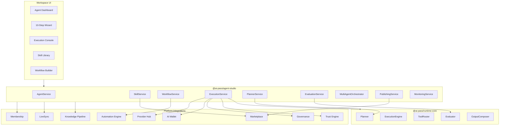

# Agent Studio — Core Intelligence Layer

Agent Studio is the **professional agent development platform** at the heart of AI-Pass. It is not a chatbot builder — it provides reusable agent infrastructure for all marketplace vertical apps (Invoice AI, Supply Chain AI, Customer Support AI, Compliance AI, etc.).

## Architecture



## Execution Lifecycle

Every agent execution follows the runtime-core lifecycle:

```
Input → Planning → Skill Selection → Execution → Evaluation → Output → Logging → Monitoring
```

## Services

| Service | Responsibility |
|---------|----------------|
| `AgentService` | CRUD, clone, archive, version, publish, share |
| `SkillService` | Skill registry, versioning, credit cost, marketplace integration |
| `WorkflowService` | Sequential/conditional/parallel workflows; wires automation-engine |
| `ExecutionService` | Full lifecycle via runtime-core |
| `PlannerService` | Delegates to runtime-core planner |
| `EvaluationService` | Delegates to runtime-core evaluator |
| `MultiAgentOrchestrator` | Agent A→B→C chains; coordinator/planner/evaluator/supervisor roles |
| `PublishingService` | Marketplace publish, version, monetize, usage/revenue tracking |
| `MonitoringService` | Execution count, latency, failures, confidence, health |
| `AnalyticsService` | Top agents/skills, success rate, credit usage |

## API Routes

| Method | Path | Description |
|--------|------|-------------|
| GET/POST/DELETE | `/api/v1/agents` | List/create/delete agents |
| GET/PUT/DELETE | `/api/v1/agents/{id}` | Agent details, update, delete |
| POST | `/api/v1/agents/{id}/execute` | Execute agent via runtime-core |
| POST | `/api/v1/agents/{id}/publish` | Publish to marketplace |
| GET/POST/PATCH | `/api/v1/agents/skills` | List/create/update skills (`?scope=member\|agents\|all`) |
| GET/PATCH | `/api/v1/workspace/skills/permissions` | Workspace skill create / availability policies |

See also: [Skill availability & permissions](./SKILL-GOVERNANCE.md).

## Seed Data

- **8 demo agents**: Invoice Extraction, Fraud Detection, Procurement Evaluator, Support Intent Router, Compliance Copilot, Research Analyst, Workflow Automation, Document Analysis
- **12 skills**: OCR, Fraud Scoring, RAG Retrieval, Decision Engine, Summarizer, Compliance Validator, Notifications, Support Intent, Procurement Scorer, Translation, Vision Inspector, API Bridge — migrated to **All members** availability
- **5 executions** with full step logs and decisions

## Multi-Agent Orchestration

Merge strategies: `sequential`, `vote`, `supervisor`. Requires Power plan (`multi_agent` feature gate).
