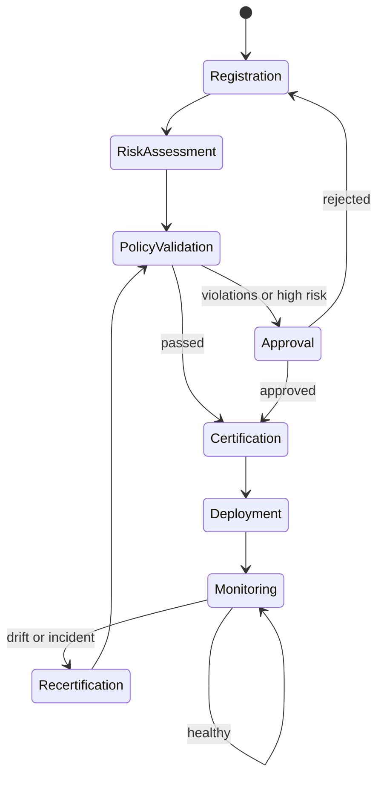
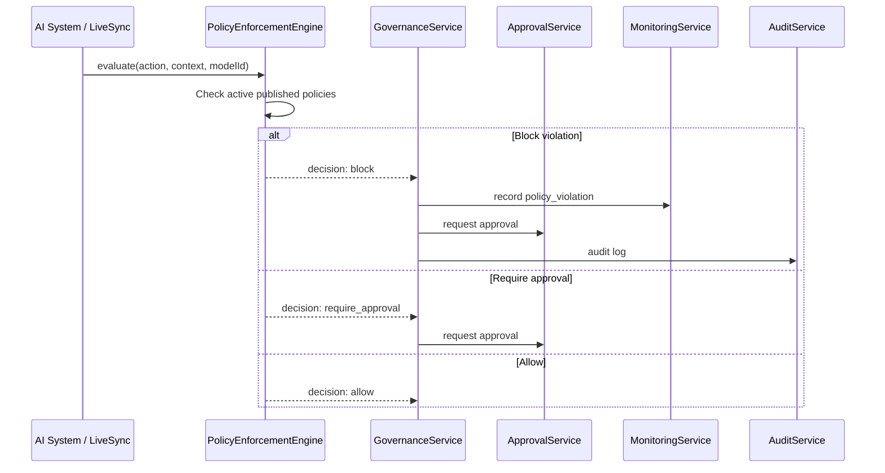

# AI Governance & Compliance Operations Platform

Enterprise operational governance layer for AI Pass — continuous monitoring, policy enforcement, and risk management. This is **not** a checklist; it is an active control plane that runs alongside every AI system.

## Architecture

```
┌─────────────────────────────────────────────────────────────────┐
│                    Governance Operations UI                      │
│  /workspace/governance  ·  /workspace/compliance               │
└────────────────────────────┬────────────────────────────────────┘
                             │
┌────────────────────────────▼────────────────────────────────────┐
│                     GovernanceService                            │
│  Orchestrates lifecycle, enforcement, audit, and integrations   │
├──────────┬──────────┬──────────┬──────────┬──────────┬──────────┤
│Inventory │ Policy   │Enforcement│  Risk   │ Approval │Monitoring│
│ Service  │ Service  │  Engine   │ Service │ Service  │ Service  │
├──────────┴──────────┴──────────┴──────────┴──────────┴──────────┤
│ Reporting · Audit · Notification (stub) · WorkflowEngine          │
└────────────────────────────┬────────────────────────────────────┘
                             │
     ┌───────────────────────┼───────────────────────┐
     │                       │                       │
┌────▼────┐            ┌─────▼─────┐          ┌──────▼──────┐
│  Trust  │            │ LiveSync  │          │ Provider Hub│
│ Engine  │            │ Workflows │          │ Model Route │
└─────────┘            └───────────┘          └─────────────┘
```

### Package: `@ai-pass/governance`

| Service | Responsibility |
|---------|----------------|
| `GovernanceService` | Central orchestration, lifecycle, integrations |
| `InventoryService` | AI system registry |
| `PolicyService` | Create, version, publish, retire policies |
| `PolicyEnforcementEngine` | Real-time policy evaluation and blocking |
| `RiskService` | AI risk register |
| `ApprovalService` | Human-in-the-loop approvals |
| `MonitoringService` | Alerts, incidents, drift detection |
| `ReportingService` | Reports and export stubs |
| `AuditService` | Immutable audit logs |
| `NotificationService` | Notification stub |
| `WorkflowEngine` | Configurable lifecycle stages |

## Governance Lifecycle



## Policy Enforcement Flow



## Integration Points

- **Trust Engine** — validation, certification, trust score, revalidation
- **LiveSync** — `GovernanceHook` on policy events and workflow steps
- **Provider Hub** — `routeModel()` blocks/routes models
- **AI Wallet** — governance usage audit trail
- **Membership** — Enterprise unlocks org-wide governance
- **Marketplace** — `checkMarketplaceInstall()` approval gates
- **Agent Studio** — `registerSystem()` on create

## API Routes

| Method | Path | Description |
|--------|------|-------------|
| GET | `/api/governance/dashboard` | Dashboard metrics |
| GET/POST | `/api/governance/ai-systems` | List / register systems |
| GET | `/api/governance/ai-systems/[id]` | System detail |
| GET/POST | `/api/governance/policy/policies` | List / create policies |
| GET | `/api/governance/risk/risks` | Risk register |
| GET/POST | `/api/governance/approve` | Approvals queue / process |
| GET/POST | `/api/governance/monitor` | Monitoring events |
| GET/POST | `/api/governance/reports` | Generate reports |
