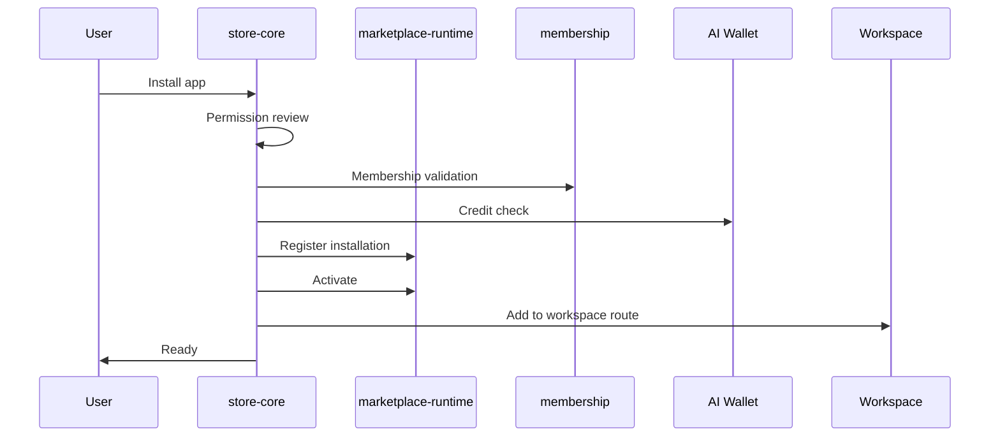

# AI Pass Store

The **AI Pass Store** is the user-facing distribution, installation, and execution layer for AI applications. It wraps `marketplace-core` and `marketplace-runtime` without duplicating catalog, skills, or runtime infrastructure.

## Architecture

```
┌─────────────────────────────────────────────────────────────┐
│  Frontend: /workspace/store  (+ alias /store)               │
│  Store Home · Categories · Search · App Details · Installed │
└──────────────────────────┬──────────────────────────────────┘
                           │
┌──────────────────────────▼──────────────────────────────────┐
│  @ai-pass/store-api  →  REST /api/v1/store/*                  │
└──────────────────────────┬──────────────────────────────────┘
                           │
┌──────────────────────────▼──────────────────────────────────┐
│  @ai-pass/store-core                                          │
│  StoreService · InstallationService · EnterpriseStoreService  │
│  AppRegistry (delegates) · Execution · GitHub App stub        │
└──────────────────────────┬──────────────────────────────────┘
                           │
┌──────────────────────────▼──────────────────────────────────┐
│  @ai-pass/marketplace-runtime  +  @ai-pass/marketplace-core  │
│  Apps · Skills · Search · Promotions · Catalog · Wallet       │
└───────────────────────────────────────────────────────────────┘
```

## Store vs Marketplace

| Aspect | **Store** | **Marketplace** |
|--------|-----------|-----------------|
| Audience | End users, admins | Developers, platform |
| UX | Install, run, billing | Skills registry, publish, certify |
| Route | `/workspace/store` | `/workspace/marketplace` (redirects to Store) |
| Package | `@ai-pass/store-core` | `@ai-pass/marketplace-core` |
| API prefix | `/api/v1/store/*` | `/api/v1/marketplace/*` |

**Shared infrastructure:** app catalog, seed data (12 apps), skills, promotion engine, deals/collections, wallet, membership gates, trust certifications, LiveSync install events.

## Install Flow



Steps: **Install → Permission Review → Membership Validation → Wallet Check → Install → Activate → Add to Workspace → Ready**

## Execution Modes

- `in_app` — hosted SaaS UI in workspace
- `api` — REST invocation
- `workflow` — Workflow Engine
- `agent` — Agent runtime
- `scheduled` — cron triggers
- `event_triggered` — LiveSync events

All executions deduct credits via AI Wallet and record provider billing events.

## Packages

| Package | Purpose |
|---------|---------|
| `@ai-pass/routes` | Central route constants (`STORE_ROUTES`, `APP_WORKSPACE_ROUTES`) |
| `@ai-pass/store-core` | Store service layer wrapping marketplace |
| `@ai-pass/store-api` | HTTP handler functions for store endpoints |
| `@ai-pass/store` | Backward-compatible facade |

## API Endpoints

| Method | Path | Description |
|--------|------|-------------|
| GET | `/api/v1/store/home` | Featured, deals, collections |
| GET/POST | `/api/v1/store/apps` | List / register apps |
| GET | `/api/v1/store/apps/{id}` | App detail |
| POST | `/api/v1/store/install` | Full install flow |
| POST | `/api/v1/store/uninstall` | Uninstall |
| GET | `/api/v1/store/categories` | 20 categories |
| GET | `/api/v1/store/search` | Keyword + filters |
| GET/POST | `/api/v1/store/reviews` | Reviews |
| GET | `/api/v1/store/developer` | Developer dashboard |
| GET | `/api/v1/store/analytics` | Usage & revenue |
| GET | `/api/v1/store/installed` | Tenant installations |

## Enterprise Store

`EnterpriseStoreService` extends marketplace enterprise policies with:

- Private catalogs
- Approve installs before activation
- Lock app versions per org
- Disable public apps for enterprise tenants

## Revenue Share

Default **70/30** (developer/platform), configurable via `StoreService.setRevenueShare()`.

## Seed Data

12 apps in `marketplace-core/seed-data.ts` with rich detail pages, 2 demo installations (Invoice AI, Supply Chain AI), deals, and collections.

## Navigation

Platform nav includes **Store** at `/workspace/store`. Marketplace redirects to Store for end-user flows; developer sub-routes remain under `/workspace/marketplace/*` for skills and publish flows.
