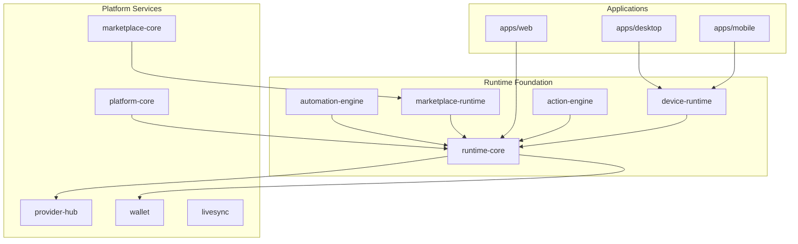

# AI Pass — System Architecture

> Enterprise AI Operating System. The **runtime** is the technical foundation all modules build upon.

See: [Runtime Architecture](./RUNTIME-ARCHITECTURE.md) · [Platform](./PLATFORM.md) · [AI OS](./AI-OS.md)

---

## Layered Architecture

---

## Core Rule

**All AI execution flows through `@ai-pass/runtime-core` Tool Router → `@ai-pass/provider-hub` → `@ai-pass/wallet`.**

Modules register in `platform-core` `ModuleRegistry`. Workspace navigation is driven by `PLATFORM_MODULE_DEFS`.

---

## Package Index

| Package | Role |
|---------|------|
| `runtime-core` | Planner, Tool Router, Execution Engine, Evaluator, Output, Monitoring |
| `automation-engine` | Workflow graphs, triggers, LiveSync bridge |
| `marketplace-core` | Skills registry, lifecycle, `SkillsRuntimeService` |
| `marketplace-runtime` | Sandbox, app executor, industry packs |
| `device-runtime` | Cross-platform execution adapters |
| `action-engine` | Secure computer actions (simulation mode) |
| `auth-core` | Auth provider stubs |
| `platform-core` | Module registry, workspace nav, runtime wiring |
| `provider-hub` | Model catalog, routing, health |
| `wallet` | Credits, usage tracking |

---

## Workspace Routes

| Route | Module |
|-------|--------|
| `/workspace/execution` | Execution Console |
| `/workspace/automation` | Automation Builder |
| `/workspace/skills` | Skill Library |
| `/workspace/providers` | Provider catalog |
| `/workspace/monitoring` | Metrics dashboard |
| `/workspace/playground` | Chat + Plan/Execute |
