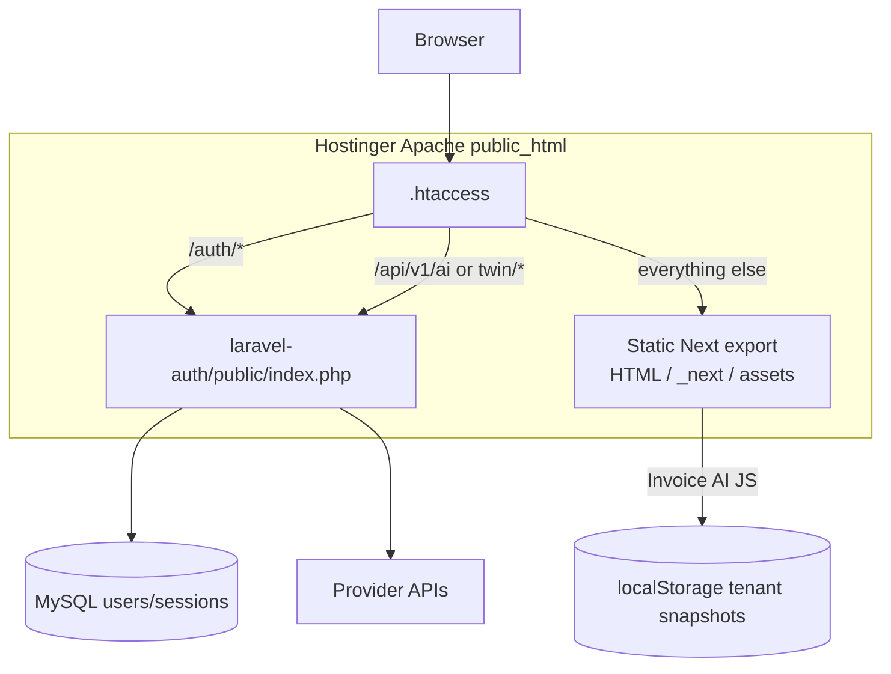
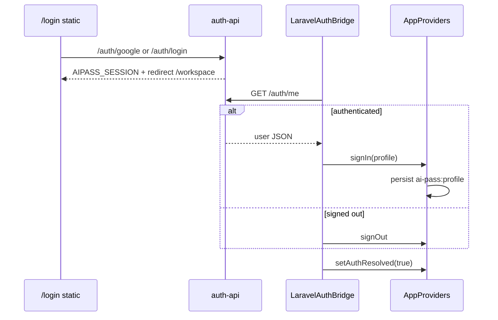
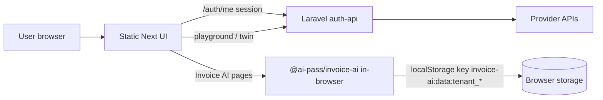
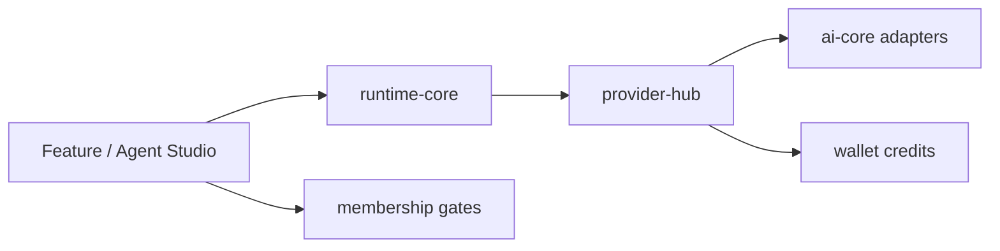
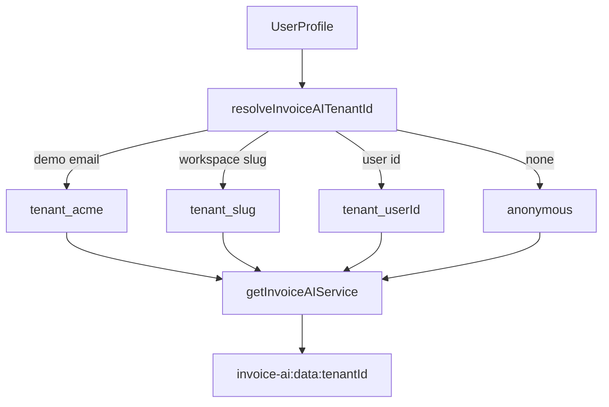

# AI Pass — System Architecture

Entry-point overview of the monorepo. Product vocabulary: [CONCEPTS.md](./CONCEPTS.md). Entity sketches: [DATA-MODEL.md](./DATA-MODEL.md). Runtime internals: [RUNTIME-ARCHITECTURE.md](./RUNTIME-ARCHITECTURE.md) and [PLATFORM.md](./PLATFORM.md).

---

## What ships in production

| Layer | Technology | Location |
|-------|------------|----------|
| Public web UI | Next.js **static export** on Hostinger Apache | `apps/web` → `apps/web/out/` → `public_html/` |
| Auth + AI proxy | Laravel 11 (sessions, Google OAuth, `/api/v1/ai|twin`) | `services/auth-api` → `laravel-auth/` (outside or under docroot) |
| Invoice AI (static mode) | Client-side `@ai-pass/invoice-ai` + per-tenant `localStorage` | `packages/invoice-ai` + `apps/web/app/workspace/apps/invoice-ai` |

There is **no Node server** on Hostinger shared hosting for the live site. API routes under `apps/web/app/api/` are stripped during static export. Local `pnpm dev:web` keeps them for NextAuth and Node APIs.

```text
Browser
  ├─ Static HTML/JS/CSS (Next export)
  ├─ /auth/*  → Apache rewrite → Laravel public/index.php
  └─ /api/v1/(ai|twin)/* → Laravel (provider keys server-side only)

Invoice AI pages call InvoiceAIService in-process (no network) when STATIC_EXPORT=1.
```

### Static hosting request path



Build/deploy: [DEPLOYMENT.md](./DEPLOYMENT.md). Auth deep dive: [LARAVEL-AUTH.md](./LARAVEL-AUTH.md).

---

## Monorepo layout

```
ai-pass/
├── apps/
│   ├── web/                 # Next.js 15 app (primary UI)
│   ├── desktop/             # Electron shell → web /ide
│   ├── mobile/              # Mobile client
│   ├── ide/                 # Downloadable IDE → aipass.space
│   ├── invoice-ai-mobile/   # Flutter scaffold for Invoice AI
│   └── docs/                # Docs site (optional static build)
├── packages/                # Shared libraries (~60 workspace packages)
├── services/
│   ├── auth-api/            # Laravel auth + AI chat / twin proxy
│   ├── ocr-service/         # Optional OCR microservice
│   └── deepteam-service/    # Optional DeepTeam service
├── php-auth/                # Legacy PHP auth (fallback; see PHP-AUTH.md)
├── scripts/                 # Build & FTP deploy
└── docs/                    # Technical documentation (this folder)
```

Workspace definition (`pnpm-workspace.yaml`):

```yaml
packages:
  - "apps/*"
  - "packages/*"
```

Tooling: **pnpm 9** + **Turbo**. Root `engines.node` is `>=20`; production static builds prefer **Node 22** (see [DEVELOPMENT.md](./DEVELOPMENT.md)).

---

## Apps vs packages vs services

| Kind | Role | Examples |
|------|------|----------|
| **Apps** | Deployable / runnable products | `@ai-pass/web`, desktop, mobile, ide |
| **Packages** | Shared TypeScript libraries consumed by apps | `invoice-ai`, `runtime-core`, `provider-hub`, `wallet` |
| **Services** | Backend processes (PHP/Python/etc.) | `auth-api`, `ocr-service` |

### Key packages (by concern)

| Concern | Packages |
|---------|----------|
| AI execution | `runtime-core` → `provider-hub` → `wallet` |
| Platform shell | `platform-core`, `view`, `workspace-rbac` |
| Business builder | `requirements`, `builder`, `templates`, `solution-runtime`, `deployment` |
| Marketplace / store | `marketplace*`, `store*`, `verticals` |
| Verticals | `invoice-ai`, `supply-chain-ai`, `customer-support-ai`, `sales-ai`, … |
| Auth stubs (TS) | `auth-core` (client helpers; live auth is Laravel) |

Core rule: **AI execution flows through `runtime-core` Tool Router → `provider-hub` → `wallet`.** Modules register in `platform-core` `ModuleRegistry`.

---

## Static web vs Laravel auth

| Concern | Static Next export | Laravel (`services/auth-api`) |
|---------|--------------------|-------------------------------|
| Serving | Apache `public_html/` | Proxied `/auth/*` (and AI API paths) |
| Build | `./scripts/build-web-static.sh` | Composer vendor + FTP script |
| Auth UI bridge | `LaravelAuthBridge` (`NEXT_PUBLIC_USE_LARAVEL_AUTH=1`) | Session cookie `AIPASS_SESSION` |
| Secrets | None in export (public env only) | `.env` on server only |
| Google redirect | N/A | `https://aipass.space/auth/google/callback` |

Apache rules live in `apps/web/public/.htaccess` (copied into `out/` after build) and are documented in `docs/apache-laravel-auth-proxy.htaccess`.

### Auth & session bridge



Deep reference: [LARAVEL-AUTH.md](./LARAVEL-AUTH.md). Concepts: [CONCEPTS.md](./CONCEPTS.md#laravel-auth-proxy).

---

## Data flow (high level)



| Flow | Path |
|------|------|
| Sign-in | `/login` → `/auth/google` or `/auth/login` → Laravel session → `/auth/me` → workspace user |
| Playground AI | Client → `/api/v1/ai/chat` (Apache → Laravel) → provider keys in Laravel `.env` |
| Invoice AI (prod static) | UI → `getInvoiceAIService(tenantId)` → engines in package → `localStorage` |
| Invoice AI (Node API) | Optional `/api/v1/invoice-ai/*` when not statically exported — see [INVOICE-AI-API.md](./INVOICE-AI-API.md) |

### AI execution spine (platform modules)



Knowledge / analytics path (platform modules): Data Products → Knowledge Pipeline → Knowledge Graph → Semantic Layer. See [KNOWLEDGE-GRAPH.md](./KNOWLEDGE-GRAPH.md).

---

## Tenant model

### Workspace / platform

Users belong to a workspace profile surfaced in the web app (`AppProviders`). Laravel stores users in MySQL (`users` UUID, `google_id`, etc.). Org membership, groups, and capabilities are separate governance tables — [WORKSPACE-GOVERNANCE.md](./WORKSPACE-GOVERNANCE.md).

### Invoice AI isolation

Invoice AI does **not** share a single global store across customers in the browser:

| Mechanism | Detail |
|-----------|--------|
| Tenant id | `resolveInvoiceAITenantId(user)` → `tenant_<workspace-slug>` or `tenant_<userId>`, else `anonymous` |
| Demo | `demo@example.com` (and optional `NEXT_PUBLIC_INVOICE_AI_DEMO=1`) → `tenant_acme` |
| Service registry | One `InvoiceAIService` instance per tenant id in-memory |
| Persistence | `localStorage` key `invoice-ai:data:{tenantId}` via `tenant-persistence.ts` |
| Filtering | All list/dashboard methods filter by `invoice.tenantId` |



See [INVOICE-AI.md](./INVOICE-AI.md) and [DATA-MODEL.md](./DATA-MODEL.md).

---

## Dual product surfaces (web)

| Mode | Routes | Users |
|------|--------|-------|
| Business builder | `/`, `/requirements`, `/studio`, `/solutions`, `/marketplace` | Non-technical + builders |
| Platform / IDE | `/ide`, `/workspace/*` | Developers & ops |
| Vertical apps | `/workspace/apps/*` | Focus-mode immersive shell |
| Admin | `/platform` | Governance / IT |

Theme (`ai-pass:theme` → `data-theme`) and app focus mode (`workspace-app-sidebar-visible`) are documented in [CONCEPTS.md](./CONCEPTS.md#theme-system).

---

## Related docs

- [CONCEPTS.md](./CONCEPTS.md) — product & tech vocabulary, glossary
- [DATA-MODEL.md](./DATA-MODEL.md) — entities, statuses, storage keys
- [DEVELOPMENT.md](./DEVELOPMENT.md) — local setup
- [DEPLOYMENT.md](./DEPLOYMENT.md) — Hostinger deploy
- [INVOICE-AI.md](./INVOICE-AI.md) — Invoice AI subsystem
- [README.md](./README.md) — full doc index
