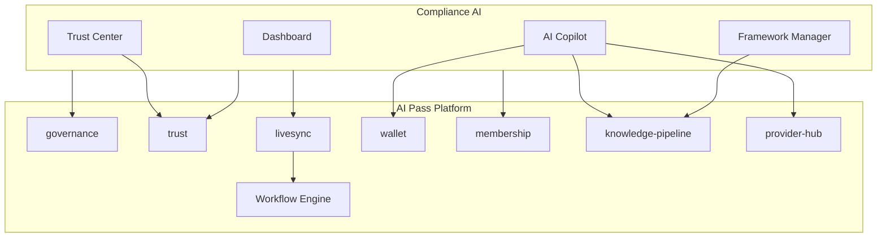

# Compliance AI — Architecture

Compliance AI is an enterprise compliance operations marketplace app inside AI Pass Workspace. It is a full operations platform — not a checklist — covering security, privacy, AI governance, certification, and regulatory automation.

## Positioning

- Multi-framework compliance management (ISO 27001, ISO 42001, SOC2, GDPR, NIS2, DORA, TISAX, ISO 9001, ISO 27701, ISO 27018)
- Risk register with security, AI, privacy, vendor, operational, and compliance categories
- Evidence library with manual upload, auto-collection stubs, and workflow automation
- Policy center with versioning, approval, and acceptance tracking
- Public Trust Center with Trust Engine certification and verification links
- AI Compliance Copilot grounded on org policies, frameworks, evidence, risks, and governance data

## Package structure

```
packages/compliance-ai/
├── src/
│   ├── index.ts                    # Platform factory, exports
│   ├── types.ts                    # Domain types
│   ├── api-types.ts                # REST request/response types
│   ├── demo-data.ts                # Seed data (3 frameworks, 20 controls, 8 risks, 5 vendors)
│   ├── agents.ts                   # Agent Studio definitions
│   ├── membership-gates.ts         # Plan gates (Free/Starter/Growth/Enterprise mapping)
│   ├── livesync.ts                 # Compliance workflow triggers
│   ├── governance-integration.ts   # Delegates to packages/governance
│   ├── trust-integration.ts        # Trust Engine scoring & certification
│   ├── knowledge.ts                # Framework docs RAG via Knowledge Pipeline
│   ├── workflow-integration.ts     # Workflow Engine stubs
│   └── services/
│       ├── compliance-ai-service.ts  # Main orchestrator
│       ├── framework-service.ts
│       ├── control-service.ts / task-service.ts
│       ├── risk-service.ts
│       ├── vendor-service.ts
│       ├── employee-compliance-service.ts
│       ├── policy-service.ts
│       ├── evidence-service.ts
│       ├── trust-center-service.ts
│       ├── copilot-service.ts
│       ├── reporting-service.ts
│       └── audit-service.ts
```

## Platform integration



| Module | Usage |
|--------|-------|
| **governance** | AI inventory, policy evaluation, approvals — delegated, not duplicated |
| **trust** | Trust scores, certification, validation reports |
| **livesync** | Model changes, vendor add, policy update, employee join/leave, risk created, evidence expiring, trust issues |
| **Workflow Engine** | Framework activation, evidence collection, risk review, policy approval, vendor reviews, employee tasks, audit prep, trust center updates |
| **wallet** | Copilot, evidence analysis, risk analysis, policy generation, reports, audit prep credits |
| **membership** | `compliance_ai`, `compliance_ai_trust_center`, `compliance_ai_copilot`, `compliance_ai_enterprise` |
| **knowledge-pipeline** | Framework documentation RAG for copilot grounding |
| **provider-hub** | Copilot model routing — no direct provider calls |
| **marketplace-core / store-core** | Registered as "Compliance AI" app |

## Framework mapping

Controls support multi-framework mapping via `mappedControlRefs`. Example: ISO 27001 A.8.2 maps to GDPR Art.32 and SOC2 CC6.x. Seed data includes cross-framework mappings for active frameworks.

## Copilot grounding

The Compliance Copilot retrieves context from:

1. Active frameworks and progress
2. Open risks and severity
3. Published policies
4. Collected evidence status
5. Governance AI system inventory (via `governance-integration`)
6. Knowledge Pipeline framework document excerpts (RAG)

Responses include citations to framework, risk, and policy records.

## Trust Center

- Preview in `/workspace/apps/compliance-ai/trust-center`
- Publish via `POST /api/v1/compliance-ai/trust-center/publish`
- Public page: `/trust/{orgSlug}`

## REST API

Base: `/api/v1/compliance-ai`

| Method | Route | Description |
|--------|-------|-------------|
| GET | `/dashboard` | Compliance dashboard KPIs |
| GET/POST | `/frameworks` | List / activate frameworks |
| GET/POST | `/controls` | Controls and tasks |
| GET/POST | `/risks` | Risk register |
| GET/POST | `/vendors` | Vendor inventory |
| GET/POST | `/policies` | Policy center |
| GET/POST | `/evidence` | Evidence library |
| GET | `/reports` | Compliance reports |
| POST | `/trust-center/publish` | Publish Trust Center |
| POST | `/copilot` | AI Compliance Copilot chat |

Headers: `x-tenant-id`, `x-user-id`, `x-membership-tier`

## Web UI

Route: `/workspace/apps/compliance-ai`

| Page | Path |
|------|------|
| Dashboard | `/` |
| Framework Manager | `/frameworks` |
| Controls & Tasks | `/controls` |
| Risk Register | `/risks` |
| Vendor Management | `/vendors` |
| Employee Compliance | `/employees` |
| Policy Center | `/policies` |
| Evidence Library | `/evidence` |
| Trust Center | `/trust-center` |
| Reports | `/reports` |
| AI Copilot | `/copilot` |
| Administration | `/admin` |

Public Trust Center: `/trust/{orgSlug}`

## Membership plan gates

| Plan (marketing) | Platform tier | Features |
|------------------|-----------------|----------|
| Free | free | — |
| Starter | professional | Core compliance AI, 3 frameworks |
| Growth / Business | power | Trust Center, Copilot, 7 frameworks |
| Enterprise | enterprise | Audit evidence packages, unlimited frameworks |

## Seed data

- 3 active frameworks: ISO 27001, GDPR, ISO 42001
- 20 controls with multi-framework mapping
- 8 risks across security, AI, privacy, vendor, operational
- 5 vendors with integration stubs
- 6 policies (templates: AI governance, security, privacy, acceptable use, data retention, incident response)
- 10 evidence items
- Trust Center demo for `acme-corp`
