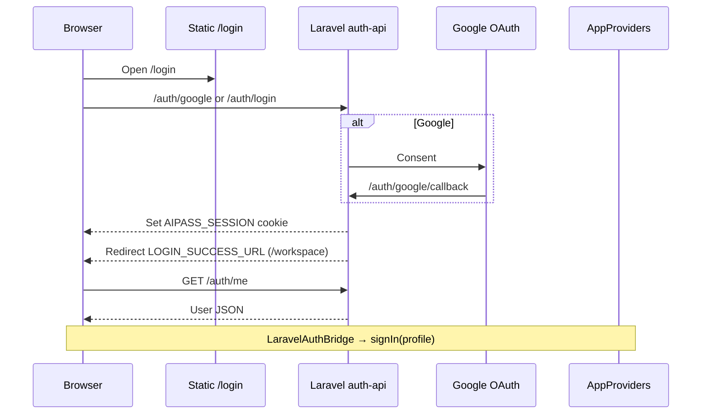
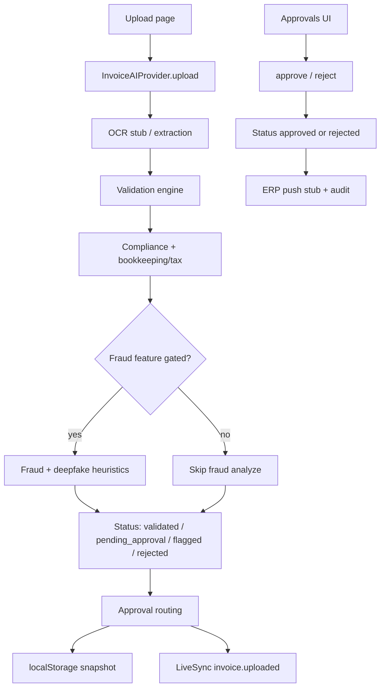

# AI Pass — Concepts & Glossary

Product and technical concepts that recur across the monorepo. For layout and deploy topology see [ARCHITECTURE.md](./ARCHITECTURE.md); for entity schemas see [DATA-MODEL.md](./DATA-MODEL.md).

---

## What AI Pass is

AI Pass is a **business solution platform** with an embedded AI workspace — not an IDE-only product.

| Audience | What they get |
|----------|----------------|
| Business users | Requirements wizard, Solution Studio, marketplace verticals (Invoice AI, Supply Chain, Support, …) |
| Developers / ops | `/workspace` platform shell, `/ide` Monaco workspace, agents, Model Hub, wallet |
| Admins / IT | Governance, people & groups RBAC, trust / compliance modules |

Two complementary product surfaces share one web app (`apps/web`):

| Surface | Primary routes | Intent |
|---------|----------------|--------|
| **Business builder** | `/`, `/requirements`, `/studio`, `/solutions`, `/marketplace` | NL → solution scaffolds |
| **Platform / workspace** | `/workspace/*`, `/ide`, `/platform` | Day-to-day AI OS + vertical apps |

Live production: [https://aipass.space](https://aipass.space) — static Next export + Laravel auth (no Node on Hostinger).

---

## Product concepts

### Workspace

The authenticated **platform shell** under `/workspace`. Modules (playground, wallet, people, apps, …) open *inside* the workspace rather than as disconnected sites. Navigation and chrome live in workspace layout clients; vertical apps hang under `/workspace/apps/<id>`.

Related: [PLATFORM.md](./PLATFORM.md), [WORKSPACE-GOVERNANCE.md](./WORKSPACE-GOVERNANCE.md).

### App (vertical / marketplace app)

A packaged capability installed or opened from the store/marketplace — e.g. Invoice AI at `/workspace/apps/invoice-ai`. Apps consume platform services (`provider-hub`, `wallet`, `membership`, `livesync`) instead of calling model vendors from UI code.

### Membership

**Universal Membership** tiers gate features and credit budgets across the platform:

| Tier | Typical unlock |
|------|----------------|
| Free | Limited playground / credits |
| Professional | Premium models, Agent Studio basics, Invoice AI core |
| Power | Broader automation / advanced vertical features |
| Enterprise | Org policy, governance packs, ERP-oriented gates |

Invoice AI specifically checks features such as `invoice_ai`, `invoice_ai_fraud`, `invoice_ai_automation`, `invoice_ai_enterprise` via `packages/invoice-ai/src/membership-gates.ts`.

Deep reference: [UNIVERSAL-MEMBERSHIP.md](./UNIVERSAL-MEMBERSHIP.md).

### Wallet

Unified **credit ledger** for AI spend. Every meaningful run (chat, OCR stub credits, validation, …) should record usage through `@ai-pass/wallet` with provider/model/module metadata. Membership tiers define monthly credit allowances; the wallet UI is `/workspace/wallet`.

### Governance (two meanings)

| Kind | Doc | Scope |
|------|-----|-------|
| **Workspace governance** | [WORKSPACE-GOVERNANCE.md](./WORKSPACE-GOVERNANCE.md) | People, groups, roles, capabilities, SCIM |
| **AI governance** | [AI-GOVERNANCE.md](./AI-GOVERNANCE.md) | AI system inventory, policies, risk |

Do not conflate org RBAC with AI-system risk registers.

### Provider Hub

Mandatory abstraction (`@ai-pass/provider-hub`) between product code and model providers. Routing, catalog, BYOK, and fallbacks live here. Feature modules must not import `@ai-pass/ai-core` directly — `ai-core` is an internal implementation layer for the hub.

### Tenant (Invoice AI)

Browser-side isolation key for Invoice AI data. Derived from the signed-in user (`resolveInvoiceAITenantId`):

| Input | Tenant id |
|-------|-----------|
| No user | `anonymous` |
| `demo@example.com` (or demo flag) | `tenant_acme` (`DEMO_TENANT_ID`) |
| Meaningful workspace name | `tenant_<slug>` |
| Else user id | `tenant_<userId>` |

One `InvoiceAIService` instance per tenant id; persistence in `localStorage` under `invoice-ai:data:{tenantId}`. This is **client isolation**, not a multi-tenant server database on Hostinger static hosting.

---

## Technical concepts

### Static export vs Node

| Mode | How | Auth | Invoice AI / APIs |
|------|-----|------|-------------------|
| **Static** (production Hostinger) | `STATIC_EXPORT=1` → `output: 'export'` | Laravel via `NEXT_PUBLIC_USE_LARAVEL_AUTH=1` | In-process package + `localStorage`; no Next API routes |
| **Node** (local `pnpm dev:web` or `DEPLOY_NODE=1`) | Next server | NextAuth (default) or Laravel/PHP flags | Optional `/api/v1/*` including invoice-ai handlers |

`scripts/build-web-static.sh` moves `app/api` aside during export, sets Laravel auth flags, and copies `.htaccess` into `out/`.

### Laravel auth proxy

Apache rewrites `/auth/*` (and `/api/v1/(ai|twin)/*`) to Laravel `public/index.php` while the rest of the site is static files. Session cookie: `AIPASS_SESSION`. The static UI hydrates via `LaravelAuthBridge` → `GET /auth/me` → `AppProviders` user profile (also mirrored to `ai-pass:profile` in `localStorage`).

Details: [LARAVEL-AUTH.md](./LARAVEL-AUTH.md).

### Theme system

`AppProviders` stores theme preference as `ai-pass:theme` (`dark` | `light` | `system`). Resolved mode is written to `document.documentElement.dataset.theme`. Workspace chrome consumes CSS variables from `@ai-pass/ui` (`workspace-theme.css`, `styles.css`). Brand logos swap on `data-theme` changes.

### Focus mode

Under `/workspace/apps/*`, the workspace sidebar is **hidden by default** so vertical apps feel immersive. Preference key: `workspace-app-sidebar-visible` (`true`/`false`). Hook: `useWorkspaceAppFocusMode` in `apps/web/app/components/workspace/useWorkspaceAppFocusMode.ts`. Outside app routes the sidebar stays visible.

### Runtime execution path

Core rule for platform AI:

```text
Feature / agent → runtime-core (tool router) → provider-hub → wallet (+ ai-core under the hub)
```

Modules register with `platform-core` `ModuleRegistry`. See [RUNTIME-ARCHITECTURE.md](./RUNTIME-ARCHITECTURE.md).

---

## Detailed flows (overview)

### Sign-in (production static)



Local Node without Laravel flags uses NextAuth instead (`AUTH.md`).

### Invoice AI upload → approve (static)



Full subsystem: [INVOICE-AI.md](./INVOICE-AI.md). Entities: [DATA-MODEL.md](./DATA-MODEL.md).

### Playground / twin AI (static)

Browser → same-origin `/api/v1/ai/chat` or `/api/v1/twin/*` → Apache → Laravel controllers → provider keys in Laravel `.env` only.

### Supply chain (two surfaces)

| Surface | Package / routes | Notes |
|---------|------------------|--------|
| Standalone Supply Chain AI | `@ai-pass/supply-chain-ai`, `/api/v1/supply-chain-ai/*` when Node | See [SUPPLY-CHAIN-AI.md](./SUPPLY-CHAIN-AI.md) |
| Invoice AI supply-chain pages | `SupplyChainEngine` inside `@ai-pass/invoice-ai` | Tenders, offers, comparisons in Invoice AI tenant snapshot |

---

## Component / package map (responsibilities)

| Concern | Primary packages / paths |
|---------|--------------------------|
| Web UI | `apps/web` |
| Desktop / IDE shells | `apps/desktop`, `apps/ide` |
| Auth (prod) | `services/auth-api` (Laravel) |
| Auth (legacy) | `php-auth` |
| Auth client helpers | `packages/auth-core`, bridges under `apps/web/app/components/auth/` |
| AI routing | `provider-hub` → `ai-core` |
| Credits / tiers | `wallet`, `membership` |
| Workspace RBAC | `workspace-rbac` |
| Module registry / shell | `platform-core`, `view`, `ui` |
| Agents | `agent-studio`, `agent`, `agent-core`, `runtime-core` |
| Knowledge stack | `data-products` → `knowledge-pipeline` → `knowledge-graph` → `semantic-layer` |
| Builder path | `requirements` → `builder` → `templates` → `solution-runtime` → `deployment` |
| Marketplace / store | `marketplace*`, `store*`, `verticals` |
| Invoice vertical | `invoice-ai` (+ shared types in `shared/invoice-ai`) |
| Other verticals | `supply-chain-ai`, `customer-support-ai`, `sales-ai`, `compliance-ai`, `content-ai`, `presence-audit` |
| OCR microservice (optional) | `services/ocr-service`, `packages/ocr` |

Apps vs packages vs services: [ARCHITECTURE.md](./ARCHITECTURE.md#apps-vs-packages-vs-services).

---

## Glossary

| Term | Meaning |
|------|---------|
| **AI Pass** | The product / monorepo; business platform + AI workspace |
| **Anonymous tenant** | Invoice AI tenant id `anonymous` when no usable user profile |
| **App focus mode** | Immersive layout for `/workspace/apps/*` with sidebar collapsed by default |
| **AppProviders** | React context for theme, user profile, onboarding, client API key prefs |
| **BYOK** | Bring-your-own-key — user/org provider keys via Model Hub / provider-hub |
| **DEMO_TENANT_ID** | Shared Invoice AI demo tenant (`tenant_acme`) with seed data |
| **Focus mode** | See app focus mode |
| **LaravelAuthBridge** | Client component that syncs `/auth/me` into AppProviders when Laravel auth is enabled |
| **LiveSync** | Event bus package (`livesync`) for cross-module refresh (e.g. `invoice.uploaded`) |
| **Membership** | Plan tier + feature matrix unlocking platform capabilities |
| **ModuleRegistry** | `platform-core` registry of workspace modules/routes |
| **NextAuth** | Node-local auth path when Laravel/PHP flags are off |
| **Provider Hub** | Sole approved entry for model invocation from feature code |
| **RBAC** | Role-based access — workspace (`workspace-rbac`) or Invoice AI roles (`tenant/rbac.ts`) |
| **Runtime-core** | Tool router / execution spine for agents and skills |
| **SCIM** | External identity provisioning into workspace groups (Laravel) |
| **Solution Studio** | Business-builder UI that turns requirements into deployable scaffolds |
| **Static export** | Next `output: 'export'` artifact hosted as plain files on Apache |
| **Tenant** | Isolation boundary — for Invoice AI, a string id + per-id service/storage |
| **Universal Membership** | Product framing: one plan, many models, one wallet |
| **Vertical** | Domain app package (finance, supply chain, support, …) |
| **Wallet** | Credit usage ledger package |
| **Workspace** | Authenticated `/workspace` OS shell |
| **Workspace governance** | People/groups/capabilities — distinct from AI governance |

---

## Related

- [ARCHITECTURE.md](./ARCHITECTURE.md) — topology & diagrams
- [DATA-MODEL.md](./DATA-MODEL.md) — entities, statuses, storage keys
- [INVOICE-AI.md](./INVOICE-AI.md) — Invoice AI feature depth
- [README.md](./README.md) — documentation index
