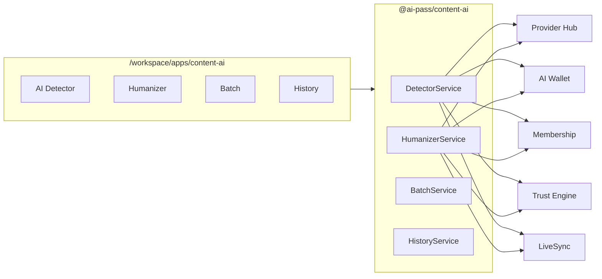

# Content AI — AI Detector & Humanizer

**Package:** `@ai-pass/content-ai`  
**User-facing name:** Content AI (AI Detector & Humanizer)  
**Route:** `/workspace/apps/content-ai`

> **Headline:** Detect AI. Humanize with Confidence.  
> **Subtitle:** Professional AI content detection and humanization — integrated with AI-Pass Trust Engine and multi-model Provider Hub.

## Overview

Content AI is a paid marketplace app in the AI-Pass ecosystem. It detects AI-generated text, humanizes drafts across multiple LLMs, and bills through the AI Wallet with membership tier gates.



## Comparison to TwainGPT

| Feature | TwainGPT | Content AI (AI-Pass) |
|---------|----------|----------------------|
| AI detection | ✓ | ✓ Sentence-level highlights + heuristic + LLM analysis |
| Humanizer | ✓ | ✓ Multi-model via Provider Hub (GPT, Claude, Gemini) |
| Tone options | Limited | Professional, casual, academic |
| Batch processing | Paid tiers | Power+ with membership gates |
| Trust scoring | — | ✓ Trust Engine integration on every scan |
| Billing | Standalone subscription | ✓ AI Wallet credits + universal membership |
| Model choice | Single vendor | ✓ Provider Hub — no vendor lock-in |
| Marketplace | — | ✓ Store listing, 70/30 revenue share, trust badge |
| API | Enterprise | ✓ Enterprise tier with API key stub |
| Ecosystem | Standalone | ✓ One membership across all AI-Pass apps |

### AI-Pass advantages

- **Multi-model:** Route detection and humanization through Provider Hub (GPT-4o, Claude 3.5 Sonnet, Gemini 1.5 Pro).
- **Trust Engine:** Trust scores on detection confidence and humanization quality.
- **AI Wallet:** Pay-per-use credits (1 detect, 5 humanize) or subscription bundle ($39/mo app).
- **One membership:** Free / Professional / Power / Enterprise gates shared with Invoice AI, Sales AI, etc.
- **Marketplace:** Certified app with trust badge eligibility and Discovery Hub listing.

## Services

| Service | Description |
|---------|-------------|
| `DetectorService` | AI probability %, human %, sentence highlights, confidence, model hints |
| `HumanizerService` | Rewrite with tone + model selection via Provider Hub |
| `BatchService` | Bulk detect/humanize (Power tier) |
| `HistoryService` | Saved scans and rewrites |
| `ContentTrustService` | Trust score on output quality |
| Wallet integration | Credits per detect (1) and humanize (5) |

## Membership gates

| Tier | Detects/mo | Humanizes/mo | Batch | API |
|------|------------|--------------|-------|-----|
| Free | 3 | 0 | — | — |
| Professional | 50 | 20 | — | — |
| Power | Unlimited | 200 | ✓ | — |
| Enterprise | Unlimited | Unlimited | ✓ | ✓ |

## Agents (Agent Studio stubs)

- **Detection Agent** — `content_detection`
- **Humanization Agent** — `content_humanize`
- **Quality Review Agent** — `content_quality_review`

## API routes

| Method | Path | Description |
|--------|------|-------------|
| POST | `/api/v1/content-ai/detect` | Run AI detection |
| POST | `/api/v1/content-ai/humanize` | Humanize text |
| GET | `/api/v1/content-ai/history` | List history |
| GET | `/api/v1/content-ai/usage` | Monthly usage & limits |

Headers: `x-tenant-id`, `x-user-id`, `x-membership-tier`

## Pricing model

- **Pay-per-use:** 1 credit/detect, 5 credits/humanize (AI Wallet)
- **App subscription:** $39/mo bundle (marketplace freemium listing)
- **Revenue share:** 70% developer / 30% platform (marketplace-core default)
- **Tags:** Writing, Marketing, Sales, Compliance, Education
- **Category:** Marketing / Developer Tools

## Frontend pages

| Page | Route |
|------|-------|
| Dashboard | `/workspace/apps/content-ai` |
| AI Detector | `/workspace/apps/content-ai/detect` |
| Humanizer | `/workspace/apps/content-ai/humanize` |
| History | `/workspace/apps/content-ai/history` |
| API | `/workspace/apps/content-ai/api` |
| Pricing | `/workspace/apps/content-ai/pricing` |
| Settings | `/workspace/apps/content-ai/settings` |

## Demo seed data

- 3 sample texts with detection results (AI, human, mixed)
- 2 humanized examples (professional + casual tones)

## Integration points

- `packages/marketplace-core` — app + skills seed (`content-ai`, `skill_content_detect`, `skill_content_humanize`)
- `packages/membership` — `content_ai`, `content_ai_humanize`, `content_ai_batch`, `content_ai_api`
- `packages/trust-engine` — certified system `sys_content_ai` / `AIP-CAI2026`
- `apps/web/app/lib/site-nav.ts` — AI Apps dropdown
- `apps/web/app/HomePageContent.tsx` — `#apps` section
- `apps/web/app/workspace/apps/page.tsx` — installed apps catalog

## Build

```bash
pnpm --filter @ai-pass/content-ai build
pnpm --filter @ai-pass/web typecheck
```
