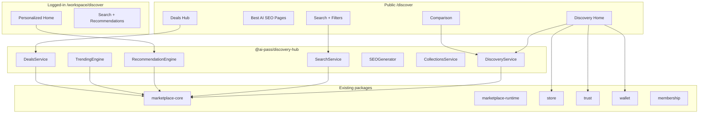

# Discovery Hub

The **Discovery Hub** is the public front door of AI Pass — intelligent tool discovery, SEO landing pages, comparison, deals, and personalized recommendations. It extends `@ai-pass/marketplace-core` and `@ai-pass/store` without duplicating app registries or seed data.

## Architecture



## Package layout

```
packages/discovery-hub/
  src/
    types.ts           # Tool, Collection, Deal, Comparison, etc.
    mappers.ts         # Application → Tool (trust score, wallet credits)
    seed-data.ts       # Best AI pages, collections, deals, news, research
    discovery-service.ts
    search-service.ts
    recommendation-engine.ts
    ranking-engine.ts  # RankingEngine + TrendingEngine
    seo-generator.ts
    collections-service.ts
    deals-service.ts
    news-service.ts
    research-service.ts
    analytics-service.ts
    index.ts           # createDiscoveryHub()
```

## Services

| Service | Responsibility |
|---------|----------------|
| `DiscoveryService` | Homepage sections, categories, tool lookup |
| `SearchService` | Keyword + semantic stub, tag/category/developer filters |
| `RecommendationEngine` | Similar, alternatives, competitors, personalized |
| `RankingEngine` | Composite ranking score |
| `TrendingEngine` | Downloads, installs, usage, growth, trust-weighted trending |
| `SEOGenerator` | Metadata for best-ai, category, tool, comparison pages |
| `CollectionsService` | Curated lists (admin-editable stub) |
| `DealsService` | Lifetime deals, bundles, enterprise packages, countdown |
| `NewsService` | AI news stub |
| `ResearchService` | Papers, benchmarks, reports stub |
| `AnalyticsService` | Views, searches, installs, clicks, conversions |

## API routes

| Method | Route | Description |
|--------|-------|-------------|
| GET | `/api/v1/discovery` | Homepage sections |
| GET | `/api/v1/discovery/search` | Search with filters |
| GET | `/api/v1/discovery/categories` | All categories |
| GET | `/api/v1/discovery/collections` | Collections (+ `?slug=`) |
| GET | `/api/v1/discovery/trending` | Trending scores + tools |
| GET | `/api/v1/discovery/featured` | Featured + editors picks |
| GET | `/api/v1/discovery/compare?a=&b=` | Tool comparison |
| GET | `/api/v1/discovery/news` | News articles |
| GET | `/api/v1/discovery/research` | Research articles |
| GET | `/api/v1/discovery/deals` | Deals list (+ `?id=`) |
| POST | `/api/v1/discovery/deals` | Activate deal |
| POST | `/api/v1/discovery/recommendations` | Recommendations |

## Frontend routes

### Public `/discover`

- `/discover` — Discovery Home
- `/discover/best/[slug]` — 10 SEO best-ai pages (static params)
- `/discover/categories`, `/discover/categories/[slug]`
- `/discover/search` — Filters: free/paid, open source, enterprise, certified, trending, top rated, region, provider
- `/discover/tools/[slug]` — Tool detail (trust, reviews, install, run)
- `/discover/compare?a=&b=` — Side-by-side comparison
- `/discover/collections`, `/discover/collections/[slug]`
- `/discover/deals`, `/discover/deals/[id]` — Deals Hub with countdown + activate
- `/discover/trending`, `/discover/news`, `/discover/research`
- `/discover/developers/promotions`

### Workspace `/workspace/discover`

- Personalized home (reuses discovery sections + recommendations)
- `/workspace/discover/search`

## SEO strategy

1. **`generateMetadata`** on best-ai and category pages via `SEOGenerator`
2. **`generateStaticParams`** for all 10 best-ai slugs and 20+ categories
3. **Sitemap stub** at `public/sitemap-discovery.xml`
4. Canonical paths per page type (best-ai, category, tool, comparison, deals)

## Trending algorithm

```
score = log10(installs + 1) × 20
      + rating × 15
      + min(reviews / 10, 10)
      + (trending ? 10 : 0)
      + (certified ? 5 : 0)
```

TrendingEngine adds growth, engagement, and trust score dimensions for leaderboard display.

## Deals Hub

Eight demo deals with types: `lifetime`, `discount`, `bundle`, `enterprise`, `limited_time`, `campaign`. Each includes:

- Original vs deal price and savings %
- Countdown end date
- Optional promo code
- POST activate → analytics conversion event

## Integrations

| System | Integration |
|--------|-------------|
| **marketplace-core** | App/skill data, search, promotions, reviews, certifications |
| **store** | Install flow via `storeRoute` → `/workspace/marketplace/apps/[id]` |
| **Trust Engine** | Trust score + badges on every `Tool` |
| **Wallet** | `creditsRequired`, `estimatedCostPerRun` on tool cards |
| **Membership** | Gates on premium best-ai lists (`membershipGate`) |
| **Workspace** | `workspaceRoute` → Run in AI-Pass |
| **Presence Audit** | Link stub on tool detail |

## Seed data

- **12 tools** from marketplace-core (mapped to `Tool`)
- **10 best-ai pages** with SEO content
- **5 collections** (Startups, Enterprise, Developers, Healthcare, Finance)
- **8 deals** with countdown
- **5 news** + **4 research** articles
- **3 comparison pairs**

## Navigation

- Landing page: **Discover** in `PremiumNav`
- Workspace sidebar: **Discover** module in `PLATFORM_MODULE_DEFS` + `PLATFORM_NAV_SECTIONS`
