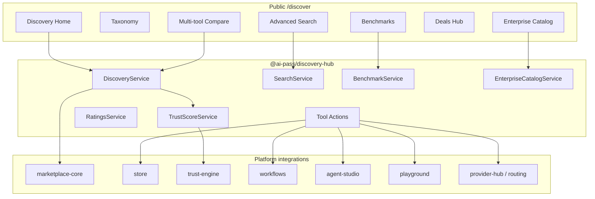

# AI Discovery Hub

The **AI Discovery Hub** expands AI-Pass beyond orchestration into an enterprise AI operating system: discover, compare, evaluate, install, connect, automate, govern, and monitor AI tools — not a static directory like Aixploria / Futurepedia / TopAI.tools.

## Journey

```
Discover → Compare → Test → Install → Connect → Automate → Govern → Monitor
```

## Architecture



## Competitive positioning

| Directory products | AI-Pass Discovery Hub |
|--------------------|------------------------|
| Browse & list | Browse **and** install / connect |
| Static profiles | Trust Score + benchmarks + ratings |
| Outbound links | Workflow + agent skill + routing |
| No governance | Enterprise approve / block catalogs |

## Package layout

```
packages/discovery-hub/src/
  types.ts                 # Tool profile, trust, ratings, benchmarks, enterprise
  taxonomy.ts              # 18-domain enterprise taxonomy
  external-catalog.ts      # External AI products (Claude, GPT, Llama, …)
  mappers.ts               # Application → Tool + profile enrichment
  discovery-service.ts     # Unified catalog (marketplace + external)
  search-service.ts        # Advanced filters
  trust-score-service.ts   # AI Trust Score + Gold/Platinum tiers
  ratings-service.ts       # User / enterprise / expert ratings
  benchmark-service.ts     # Metric snapshots + history
  enterprise-catalog-service.ts
  actions.ts               # Install, Connect, Workflow, Skill, Playground, Routing
  …
```

## Tool profile (spec)

Each tool exposes:

- **General** — name, logo, website, developer, country, launch date
- **Capabilities** — text, vision, audio, video, code, multimodal
- **Models** — GPT, Claude, Gemini, Llama, Mistral, DeepSeek, Qwen
- **Deployment** — cloud, on-prem, API, Docker, local
- **Pricing** — free, freemium, subscription, pay-as-you-go, enterprise
- **Integrations** — Slack, Teams, Notion, Drive, GitHub, Zapier, …
- **Security** — GDPR, SOC2, ISO27001, HIPAA, ISO42001
- **Actions** — Install, Connect, Add to Workflow, Add as Agent Skill, Compare, Benchmark, Save, Request Approval, Playground, Routing

## AI Trust Score

Computed from security, privacy, compliance, reliability, community rating, benchmark results, and maintenance frequency.

Tiers: **Platinum / Gold / Silver / Bronze / Unrated** (e.g. `92/100 · Gold Certified`). Integrates with `@ai-pass/trust-engine` when a resource score exists.

## APIs

| Method | Route | Description |
|--------|-------|-------------|
| GET | `/api/v1/discovery` | Homepage sections |
| GET | `/api/v1/discovery/search` | Advanced search |
| GET | `/api/v1/discovery/taxonomy` | Taxonomy + catalog stats |
| GET | `/api/v1/discovery/compare?ids=` | Multi-tool comparison |
| GET | `/api/v1/discovery/benchmarks` | Leaderboard or `?tool=` |
| GET/POST | `/api/v1/discovery/enterprise` | Policy, approve/block, inventory |
| GET | `/api/v1/discovery/analytics` | Dashboard metrics |
| GET | `/api/v1/discovery/actions?tool=` | Orchestration actions + routing prefs |
| GET | `/api/v1/discovery/deals` | Deals Hub |
| POST | `/api/v1/discovery/recommendations` | Recommendations |

## Frontend routes

- `/discover` — Hub home (journey messaging + taxonomy)
- `/discover/search` — Filters: taxonomy, model, pricing, compliance, OSS, API, local, enterprise
- `/discover/taxonomy`, `/discover/taxonomy/[slug]`
- `/discover/tools/[slug]` — Full profile + actions
- `/discover/compare` — Side-by-side (2–N tools)
- `/discover/benchmarks`
- `/discover/enterprise` — Org catalogs
- `/discover/analytics`
- `/discover/collections`, `/discover/deals`, …

Workspace: `/workspace/discover` (personalized shell).

## Seed data

- Marketplace apps mapped to rich `Tool` profiles
- External catalog samples (Claude, GPT, DeepSeek, Llama, Mistral, Gemini, Qwen, Midjourney, ElevenLabs, Pinecone, Runway, Whisper)
- Collections: Developers, Research, Open-Source LLMs, Local Models, Agents, Marketing, Finance, Enterprise, …

## Integrations

| System | Role |
|--------|------|
| **marketplace-core / store** | Installable apps & distribution |
| **Trust Engine** | Score inputs + certification alignment |
| **Workflows** | `Add to Workflow` deep link |
| **Agent Studio** | `Add as Agent Skill` deep link |
| **Playground** | Multi-model test + cost/latency |
| **Provider Hub / Routing** | Fixed, auto, cost, latency, quality, local, compliance routes |
| **Deals Hub** | Discounts, LTD, enterprise, student, startup credits |
| **Membership** | Gates on premium best-AI lists |

## Navigation

- Marketing: Marketplace → **Discovery Hub**, Benchmarks, Enterprise Catalog (`site-nav.ts`)
- Workspace module: `discover` in `PLATFORM_MODULE_DEFS`
- Route constants: `DISCOVERY_ROUTES` / `DISCOVERY_API_ROUTES` in `@ai-pass/routes`
