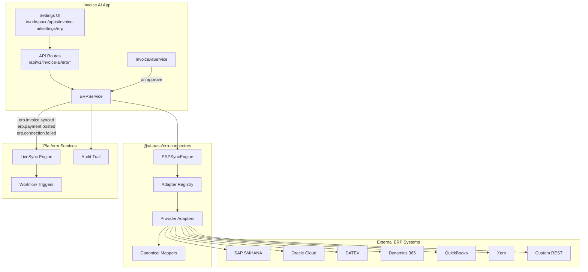

# ERP Integration — Invoice AI

Enterprise ERP connectivity for AI-Pass Invoice AI via the `@ai-pass/erp-connectors` package. Uses the adapter pattern with platform services (LiveSync, Workflow Engine, AI Wallet, Audit Logs) — no duplicated platform capabilities.

## Architecture



## Package Structure

```
packages/erp-connectors/
├── src/
│   ├── types.ts              # ERPConnection, CanonicalInvoice, ERPSyncResult
│   ├── ERPConnector.ts       # Base interface + BaseERPAdapter
│   ├── registry.ts           # Provider registry
│   ├── sync-engine.ts        # Bidirectional sync, idempotency, retry
│   ├── credentials.ts        # env:/vault secret resolution
│   ├── rate-limiter.ts       # Rate limiting + exponential backoff
│   ├── adapters/             # Provider-specific adapters
│   └── mappers/              # ERP ↔ canonical field mapping
```

## Adapter Capabilities

| Provider | Status | Push Invoice | Pull Invoice | Push Vendor | OAuth2 | Notes |
|----------|--------|--------------|--------------|-------------|--------|-------|
| SAP S/4HANA | Stub | ✓ structured OData payload | Stub (empty) | ✓ | API key / OAuth | OData v4 AP invoice pattern |
| Oracle Cloud | Stub | ✓ Fusion Payables REST | Stub | ✓ | OAuth2 | FBDI-compatible field map |
| DATEV | Partial stub | ✓ Belegdatenservice map | Stub | ✓ | API key / OAuth | DE tax fields, consultant/client numbers |
| Dynamics 365 | Stub | ✓ VendInvoiceJournal OData | Stub | ✓ | Azure AD OAuth2 | D365 Finance entity pattern |
| QuickBooks | Structured stub | ✓ Bill entity | Stub | ✓ | OAuth2 + realmId | QBO API v3 payload structure |
| Xero | Structured stub | ✓ ACCPAY invoice | Stub | ✓ | OAuth2 + tenantId | Accounting API 2.0 |
| Custom REST | Functional stub | ✓ configurable endpoints | Stub | ✓ | API key / OAuth | Webhook parser included |

**Stub** = real payload/endpoint structure, no live HTTP calls (safe for demo/static export).  
**Structured stub** = production-ready request shapes; connect credentials to go live.

## Per-ERP Setup Guides

### SAP S/4HANA / Business One

1. Create communication user in SAP with OData service access (`API_SUPPLIERINVOICE_PROCESS_SRV`).
2. Set connection config:
   - `baseUrl`: `https://<host>`
   - `systemId`, `client`, `companyCode`
3. Credentials: `apiKeyRef: "env:SAP_API_KEY"` or OAuth2 client credentials.
4. Field mapping: invoice → `SupplierInvoice` OData entity; vendor tax ID → `Supplier`.

### Oracle Fusion Cloud ERP

1. Register IDCS OAuth app in Oracle Cloud console.
2. Config: `baseUrl`, `pod`, `ledgerId`.
3. Credentials: `clientId`, `clientSecretRef: "env:ORACLE_CLIENT_SECRET"`.
4. Scopes: `urn:opc:resource:consumer::all`.

### DATEV (Germany)

1. Register app at [DATEV Developer Portal](https://developer.datev.de).
2. Config: `consultantNumber`, `clientNumber`, `fiscalYear`, `defaultGlAccount`.
3. Credentials: `apiKeyRef: "env:DATEV_API_KEY"` or OAuth2.
4. Maps to Belegdatenservice header/line_items with 19% USt default.

### Microsoft Dynamics 365 Finance

1. Register app in Azure AD; grant D365 F&O API permissions.
2. Config: `baseUrl`, `company` (dataAreaId), `environment`.
3. Credentials: `clientId`, `clientSecretRef`, `tenantId` (Azure AD).
4. Uses `VendInvoiceJournalHeaders` OData entity.

### QuickBooks Online

1. Create app at [Intuit Developer](https://developer.intuit.com).
2. Complete OAuth2 flow; store tokens via `refreshTokenRef: "env:QBO_REFRESH_TOKEN"`.
3. Config: `realmId` (company ID), `sandbox: true|false`.
4. Push creates `Bill` with `AccountBasedExpenseLineDetail` lines.

### Xero

1. Create app at [Xero Developer](https://developer.xero.com).
2. OAuth2 with accounting scopes; store `tenantId` (Xero org ID).
3. Push creates `ACCPAY` invoice with `LineItems`.
4. Webhook: `POST /api/v1/invoice-ai/erp/webhook/xero`.

### Custom REST API

1. Config: `baseUrl`, `healthPath`, `paths.invoices`, `paths.vendors`.
2. Credentials: `apiKeyRef` or OAuth2.
3. Webhook: `POST /api/v1/invoice-ai/erp/webhook/custom`.

## Security & Auth

- **Never commit secrets.** Use `env:VAR_NAME` references in connection profiles.
- Credentials resolved at runtime via `resolveCredentialRef()` — not logged or persisted.
- Per-tenant connection isolation: all queries scoped by `tenantId`.
- Webhook endpoints validate provider type; extend with HMAC signature verification per provider in production.
- OAuth2 refresh tokens stored in vault references only.

## Field Mapping (Canonical → ERP)

| Canonical Field | SAP | Oracle | DATEV | Dynamics | QuickBooks | Xero |
|-----------------|-----|--------|-------|----------|------------|------|
| invoiceNumber | SupplierInvoice | InvoiceNumber | header.invoice_id | InvoiceNumber | DocNumber | InvoiceNumber |
| amount | InvoiceGrossAmount | InvoiceAmount | header.gross_amount | InvoiceAmount | TotalAmt | LineAmount sum |
| currency | DocumentCurrency | InvoiceCurrencyCode | currency_code | CurrencyCode | CurrencyRef | CurrencyCode |
| vendorTaxId | Supplier | SupplierTaxRegistrationNumber | parties.vendor_tax_id | VendorAccountNumber | — | TaxNumber |
| dueDate | DueCalculationBaseDate | TermsDate | — | DueDate | DueDate | DueDate |
| items[].glAccount | PurchaseOrder | DistributionCombination | account_number | MainAccount | AccountRef | AccountCode |

## API Routes

| Method | Path | Description |
|--------|------|-------------|
| GET | `/api/v1/invoice-ai/erp/connections` | List tenant connections |
| POST | `/api/v1/invoice-ai/erp/connections` | Create connection profile |
| POST | `/api/v1/invoice-ai/erp/connections/{id}/test` | Test connection |
| POST | `/api/v1/invoice-ai/erp/connections/{id}/sync` | Trigger sync (pull reconciliation) |
| GET | `/api/v1/invoice-ai/erp/connections/{id}/health` | Health check |
| POST | `/api/v1/invoice-ai/erp/webhook/{provider}` | Inbound ERP webhooks |

Headers: `x-tenant-id`, `x-user-id`, `x-membership-tier`.

## LiveSync Events

| Event | Trigger | Workflow |
|-------|---------|----------|
| `erp.invoice.synced` | Invoice pushed to ERP after approval | Payment agent workflow |
| `erp.payment.posted` | Payment recorded in ERP | Payment agent workflow |
| `erp.connection.failed` | Connection test/sync failure | Governance escalation |
| `erp.sync` | Scheduled/manual reconciliation | Payment agent workflow |

## Invoice AI Workflow Integration

1. **Upload** → OCR → validation → approval routing (unchanged).
2. **Approve** → `InvoiceAIService.approve()` → `ERPService.pushApprovedInvoice()` → adapter push with idempotency key.
3. **Success** → LiveSync `erp.invoice.synced` + audit log entry.
4. **Scheduled sync** → `POST .../sync` pulls vendors/invoices for reconciliation (polling complement to webhooks).

## Idempotency

Sync engine builds keys: `{tenantId}:{connectionId}:{entityType}:{entityId}:{operation}`.

Duplicate pushes return `skipped` status with existing `externalId` — safe for workflow retries.

## Static Export Mode

When `STATIC_EXPORT=1`, API routes are unavailable. The ERP settings UI falls back to in-memory `defaultERPService` for demo connectivity.

Set `NEXT_PUBLIC_STATIC_EXPORT=1` in the UI for the same fallback behavior.

## Troubleshooting

| Symptom | Cause | Fix |
|---------|-------|-----|
| Connection test fails: missing credentials | Env var not set | Set `env:VAR_NAME` target in deployment secrets |
| DATEV test fails | Missing consultant/client numbers | Add `consultantNumber`, `clientNumber` to config |
| QuickBooks: missing realmId | OAuth incomplete | Complete OAuth flow; set `realmId` in credentials |
| Push skipped | Idempotency key exists | Expected on retry; check `externalId` in audit log |
| ERP push not triggered on approve | No active connection | Create connection, run Test, ensure status `active` |
| Webhook 400 | Unknown provider or missing externalId | Verify provider slug and payload shape |

## Development

```bash
pnpm install
pnpm --filter @ai-pass/erp-connectors build
pnpm --filter @ai-pass/invoice-ai build
pnpm --filter @ai-pass/web build
```

Environment variables (examples — never commit values):

```bash
XERO_CLIENT_SECRET=...
QBO_REFRESH_TOKEN=...
SAP_API_KEY=...
DATEV_API_KEY=...
ORACLE_CLIENT_SECRET=...
```
