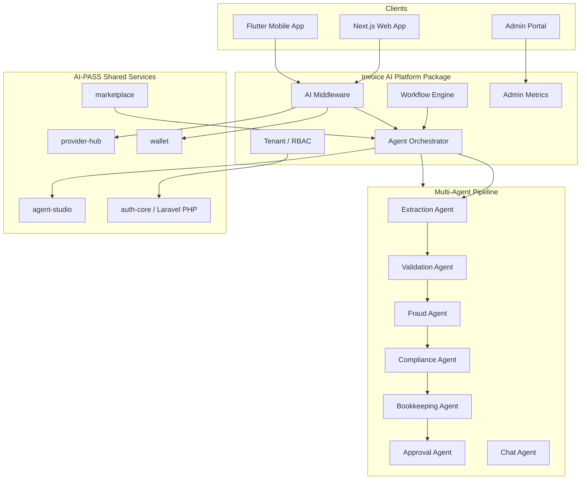

# Invoice AI Platform Architecture

Invoice AI is an AI-powered Financial Automation Platform within the AI-PASS marketplace. This document maps the platform architecture, phased roadmap, and component ownership.

## Architecture Overview



## End-to-End Flow

```
Login → Upload → AI Middleware (PII mask + model route) → OCR/Extraction
  → Validation → Fraud → Compliance → Bookkeeping → Approval → Reporting → Chat
```

## Package Layout

| Path | Purpose | Spec Coverage |
|------|---------|---------------|
| `packages/invoice-ai/src/middleware/` | PII masking, AI router facade, cost estimation | AI Middleware |
| `packages/invoice-ai/src/orchestrator/` | Planner + agent pipeline wiring | Multi-agent orchestration |
| `packages/invoice-ai/src/workflow/` | Trigger/condition/approval execution | Workflow engine |
| `packages/invoice-ai/src/tenant/` | Tenant context, RBAC roles/permissions | Multi-tenant, RBAC |
| `packages/invoice-ai/src/admin/` | Platform metrics stubs | Admin portal scaffolding |
| `packages/invoice-ai/src/services/` | OCR, fraud, compliance, invoice-service | Core engines (existing) |
| `apps/web/.../invoice-ai/` | Web UX (Home, Portfolio, Upload, Chat, Admin) | Client UI |
| `apps/invoice-ai-mobile/` | Flutter scaffold | Mobile-ready APIs |

## Reused Monorepo Packages

| Package | Role in Invoice AI |
|---------|-------------------|
| `@ai-pass/provider-hub` | Model catalog, routing engine, provider health |
| `@ai-pass/wallet` | Credit/token cost tracking per request |
| `@ai-pass/agent-studio` | Agent registry, execution, multi-agent chains |
| `@ai-pass/marketplace` | Automation packs, skill executor, industry packs |
| `@ai-pass/platform-core` | Shared tenant primitives (extended in invoice-ai/tenant) |

## Phased Roadmap

### Phase 1 — Foundation (Current)

- [x] AI middleware scaffolding (PIIMasker, AIRouter, AIMiddleware)
- [x] Agent orchestrator + planner stubs
- [x] Workflow engine with trigger/condition/approval steps
- [x] Tenant context + RBAC role types
- [x] Admin metrics service + web admin page
- [x] Middleware wired into upload pipeline
- [x] Platform status banner on Home
- [x] Unit tests for PII masker and AI router
- [x] Architecture, API, and deployment documentation
- [x] Flutter mobile scaffold

### Phase 2 — Production APIs & Auth

- [ ] Laravel/PHP API routes for all invoice-ai endpoints
- [ ] Google / Microsoft / GitHub / email / MFA auth providers
- [ ] Real provider-hub execution (replace OCR stub)
- [ ] Persistent workflow run storage
- [ ] RBAC enforcement on API routes
- [ ] Marketplace pack install via API

### Phase 3 — Mobile & Integrations

- [ ] Full Flutter app (upload, portfolio, approvals, push notifications)
- [ ] ERP connector live sync (SAP, DATEV, QuickBooks)
- [ ] Webhook/event streaming for workflow state
- [ ] Export pipelines (CSV, DATEV, audit PDF)
- [ ] Industry automation pack marketplace listing

### Phase 4 — Enterprise Scale

- [ ] Kubernetes deployment with tenant isolation
- [ ] Load testing and SLO dashboards
- [ ] Cross-region data residency policies
- [ ] Governance policy engine integration
- [ ] SOC2/ISO audit artifact generation

## Component Map vs Specification

| Spec Item | Status | Location |
|-----------|--------|----------|
| PII masking | Implemented (regex-based stub) | `middleware/pii-masker.ts` |
| Multi-model router | Implemented (provider-hub) | `middleware/ai-router.ts` |
| Cost/token tracking | Implemented (wallet) | `invoice-service.ts`, `wallet` |
| Multi-agent orchestration | Stub pipeline | `orchestrator/` |
| Workflow engine | Functional stub | `workflow/workflow-engine.ts` |
| Compliance engine | Existing | `services/compliance-engine.ts` |
| Fraud engine | Existing | `services/fraud-engine.ts` |
| Bookkeeping | Existing (compliance output) | `services/compliance-engine.ts` |
| Multi-tenant | Types + demo context | `tenant/` |
| RBAC | Role/permission matrix | `tenant/types.ts` |
| Marketplace packs | Existing demo data | `demo-data.ts`, `use-case-engine.ts` |
| Admin portal | Web stub + metrics service | `admin/`, `admin/page.tsx` |
| Mobile APIs | Documented + Flutter scaffold | `docs/INVOICE-AI-API.md`, `apps/invoice-ai-mobile/` |
| Reporting | Existing web pages | `reports/page.tsx` |

## Local Development

```bash
# Build platform package
pnpm --filter @ai-pass/invoice-ai build

# Run unit tests
pnpm --filter @ai-pass/invoice-ai test

# Start web app
pnpm dev:web
# Navigate to /workspace/apps/invoice-ai
```
