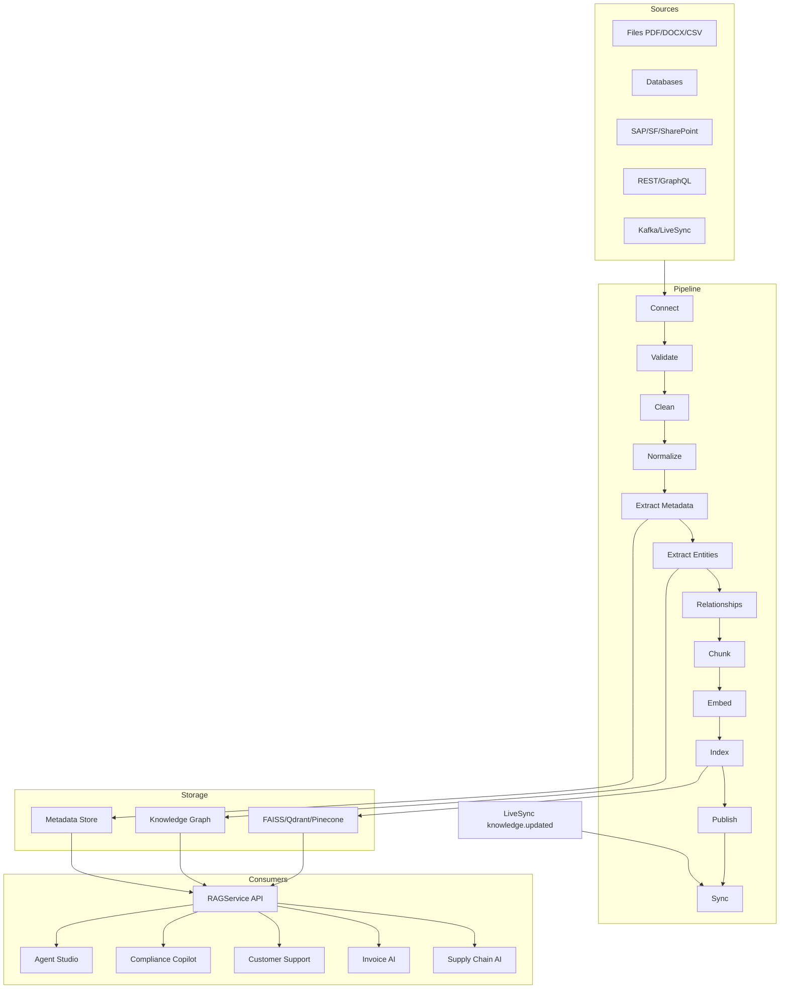

# Knowledge Pipeline Engine

Enterprise knowledge infrastructure for AI Pass — the **single source of truth** for all AI context, not just RAG.

## Architecture

The Knowledge Pipeline Engine (`@ai-pass/knowledge-pipeline`) provides a unified platform for ingesting, enriching, indexing, and serving knowledge to agents, copilots, and marketplace apps.



## Package Structure

| Service | Responsibility |
|---------|----------------|
| `ConnectorService` | Files, databases, enterprise, APIs, streaming connectors |
| `PipelineService` | Visual pipeline stages and reusable templates |
| `DataCleaningService` | Dedup, normalize, validate, encode |
| `MetadataService` | Semantic enrichment — entities, topics, keywords |
| `EmbeddingService` | Embeddings via provider-hub stubs |
| `GraphService` | Entity-relationship graph, ontology stubs |
| `VectorStore` | Pluggable vector backends (FAISS default) |
| `RetrievalService` | Semantic, keyword, hybrid, metadata filter |
| `RAGService` | Unified agent context API |
| `SynchronizationService` | LiveSync re-index on document change |
| `PublishingService` | RAG endpoints and context packages |
| `GovernanceService` | RBAC, lineage, PII, retention, audit |

## Pipeline Stages

1. **Connect** — attach data source
2. **Validate** — schema and format checks
3. **Clean** — dedup, text normalization
4. **Normalize** — dates, currency, encoding
5. **Extract Metadata** — topics, keywords, categories
6. **Extract Entities** — NER-style entity extraction
7. **Relationships** — build graph edges
8. **Chunk** — split documents for retrieval
9. **Embed** — generate vector embeddings
10. **Index** — upsert to vector store
11. **Publish** — expose via API endpoints
12. **Sync** — LiveSync-driven refresh

## RAG API

### REST Endpoints

| Method | Path | Description |
|--------|------|-------------|
| `POST` | `/api/v1/knowledge/source` | Create knowledge source (via `/sources`) |
| `GET` | `/api/v1/knowledge/sources` | List sources |
| `POST` | `/api/v1/knowledge/pipeline` | Create pipeline |
| `POST` | `/api/v1/knowledge/embed` | Embed content |
| `POST` | `/api/v1/knowledge/query` | RAG query |
| `POST` | `/api/v1/knowledge/graph/query` | Graph traversal |
| `POST` | `/api/v1/knowledge/sync` | Trigger sync |
| `GET` | `/api/v1/knowledge/status` | Platform status |

### Programmatic API

```typescript
import { getKnowledgePlatform } from '@ai-pass/knowledge-pipeline';

const kp = getKnowledgePlatform();

// Unified RAG for agents
const result = kp.rag.query({
  query: 'What is the return policy?',
  tenantId: 'tenant_acme',
  topK: 5,
  mode: 'hybrid',
  includeGraph: true,
});

// result.chunks, result.citations, result.confidence, result.graphLinks
```

### Agent Studio Integration

Agents retrieve context **only** via `RAGService.retrieveContext()` during execution. Context is injected as `knowledgeContext`, `knowledgeCitations`, and `knowledgeConfidence` in the execution input.

## Vector Store Abstraction

```typescript
const store = kp.vectorStore;
store.setProvider('faiss'); // default in-memory
// stubs: qdrant, chromadb, pinecone, weaviate
store.upsert(embedding, chunkId);
store.search(queryVector, topK);
```

## Integrations

| Module | Integration |
|--------|-------------|
| **Agent Studio** | `RAGService.retrieveContext()` in execution |
| **Compliance AI** | Framework doc ingestion + copilot grounding |
| **Customer Support AI** | FAQ/policy retrieval |
| **Invoice AI** | Finance knowledge fallback in chat |
| **Supply Chain AI** | Policy retrieval via knowledge refs |
| **LiveSync** | `knowledge.updated` → `SynchronizationService` |
| **AI Wallet** | Embedding, indexing, retrieval credits |
| **Membership** | `knowledge_pipeline` feature (Power+) |
| **Trust Engine** | Lineage, freshness, trust scores |
| **Governance** | PII detection, RBAC, retention |

## Seed Data

- 3 sources (Financial Reports, Compliance Policies, Product Documentation)
- 2 pipelines (Standard RAG, Semantic Graph)
- 50 demo chunks
- Sample graph: Acme Corp → products → policies
- 6 retrieval test queries

## Workspace UI

Navigate to `/workspace/knowledge` for:

- Knowledge Dashboard
- Data Sources
- Pipeline Builder
- Knowledge Graph
- Embeddings
- Search Workspace
- RAG Playground
- Synchronization Monitor
- Governance
- Administration

## Membership Limits

Knowledge Pipeline requires **Power** plan or higher (`knowledge_pipeline` feature). Enterprise adds unlimited connections and governance integration.
