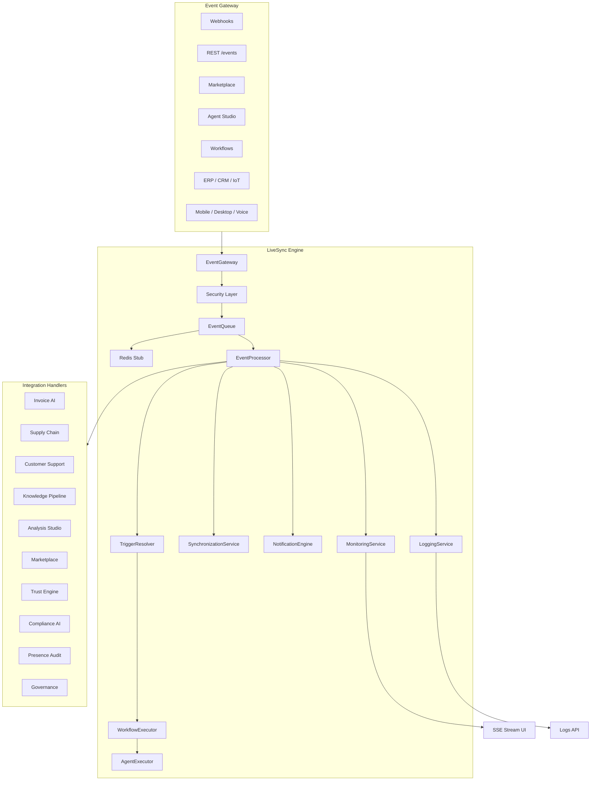

# LiveSync Engine

AI-Pass LiveSync is the real-time, event-driven execution backbone — the nervous system connecting webhooks, marketplace apps, agents, workflows, knowledge, trust, and compliance.

## Architecture



## Event flow

1. **Ingest** — `EventGateway` validates schema, applies RBAC, tenant isolation, rate limits, webhook signatures, and replay protection.
2. **Enqueue** — Events enter `EventQueue` (FIFO + priority + delayed/scheduled + retry + dead letter). Redis stub delegates to in-memory in dev.
3. **Process** — `EventProcessor` validates, enriches payload, resolves triggers, runs workflows/agents, dispatches integration handlers.
4. **Execute** — `WorkflowExecutor` runs steps. `AgentExecutor` uses runtime-core evaluator.
5. **Sync** — `SynchronizationService` pushes updates to dashboards, widgets, knowledge, marketplace, wallet, CRM, ERP, mobile, desktop.
6. **Notify** — `NotificationEngine` stubs email, SMS, push, Slack, Teams, webhook, voice.
7. **Monitor** — EPS, queue depth, latency p95, failure/retry rates, dead letters.

## Docker Compose (Redis)

```yaml
services:
  redis:
    image: redis:7-alpine
    ports:
      - "6379:6379"
    volumes:
      - livesync-redis:/data

volumes:
  livesync-redis:
```

Set `REDIS_URL=redis://localhost:6379`.

## API endpoints

| Method | Path | Description |
|--------|------|-------------|
| POST | `/api/v1/events` | Ingest event |
| POST | `/api/v1/events/webhook` | Webhook ingest |
| POST | `/api/v1/events/test` | Test harness |
| GET | `/api/v1/events` | List events |
| GET | `/api/v1/events/{id}` | Event detail |
| GET | `/api/v1/events/logs` | Logs |
| GET | `/api/v1/queue` | Queue stats |
| GET | `/api/v1/health` | Health |
| POST | `/api/v1/events/retry` | Retry |
| POST | `/api/v1/events/replay` | Replay |
| GET | `/api/v1/events/stream` | SSE stream |
| GET | `/api/v1/livesync/metrics` | Metrics / Prometheus |

## UI routes

`/workspace/workflows/livesync` — Dashboard, Events, Queue, Triggers, Workflows, Agents, Replay, Logs, Monitoring, Admin.

## Integration matrix

| Module | Events |
|--------|--------|
| Invoice AI | `invoice.uploaded` |
| Supply Chain | `supplier.updated`, `offer.*` |
| Customer Support | `support.*` |
| Knowledge | `knowledge.*` |
| Analysis | `analysis.*` |
| Marketplace | `marketplace.installed` |
| Trust | `trust.*` |
| Compliance | `compliance.*` |
| Presence | `presence.*` |
| Governance | `policy.updated` |

Use `publishEvent()` from `@ai-pass/livesync`.
