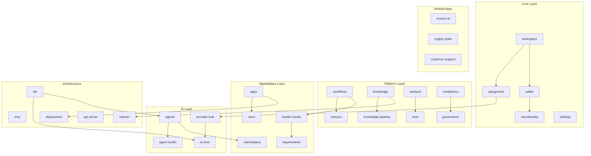

# AI Pass Platform — Architecture & Backlog

> **Enterprise AI Operating System** — one unified workspace, 25+ modular capabilities.

See also: **[AI Operating System (Master)](./AI-OS.md)** · [Architecture](./ARCHITECTURE.md) · [Runtime Architecture](./RUNTIME-ARCHITECTURE.md) · [API](./API.md) · [Universal Membership](./UNIVERSAL-MEMBERSHIP.md) · [Backlog](./BACKLOG.md)

---

## Vision

AI Pass is not disconnected pages — it is **one product**: an OS shell (`/workspace`) where every capability opens inside the workspace.

**Brand:** AI Pass Platform (not "Developer IDE")

**Core rule:** Apps consume AI only through `@ai-pass/provider-hub` + `@ai-pass/wallet` (never direct `@ai-pass/ai-core` in apps).

---

## Module Dependency Graph (25 modules)



---

## Unified Navigation (14 primary items)

| # | Module | Route | Status |
|---|--------|-------|--------|
| 1 | Workspace | `/workspace` | done |
| 2 | AI Playground | `/workspace/playground` | done |
| 3 | Agents | `/workspace/agents` | stub |
| 4 | Workflows | `/workspace/workflows` | stub |
| 5 | Knowledge | `/workspace/knowledge` | stub |
| 6 | Analysis | `/workspace/analysis` | stub |
| 7 | Marketplace | `/workspace/marketplace` | done |
| 8 | AI Apps | `/workspace/apps` | done |
| 9 | Trust Center | `/workspace/trust` | done |
| 10 | Compliance | `/workspace/compliance` | stub |
| 11 | Presence Audit | `/workspace/presence` | stub |
| 12 | Wallet | `/workspace/wallet` | done |
| 13 | Settings | `/workspace/settings` | done |
| 14 | Administration | `/workspace/admin` | stub |

**Secondary modules:** provider-hub, membership, requirements, builder-studio, ide, agent-studio, livesync, invoice-ai, supply-chain, customer-support.

Registry: `@ai-pass/platform-core` → `ModuleRegistry`, `PLATFORM_MODULE_DEFS`, `WorkspaceService`, `GlobalSearchService`.

---

## Package Map

| Package | Role |
|---------|------|
| `@ai-pass/platform-core` | ModuleRegistry, navigation, WorkspaceService, GlobalSearch, TenantContext, EventBus |
| `@ai-pass/platform-api` | REST route stubs, OpenAPI types, handler scaffolds |
| `@ai-pass/provider-hub` | ModelCatalog, ProviderRegistry, RoutingEngine, HealthMonitor |
| `@ai-pass/membership` | Plans, entitlements, MembershipService |
| `@ai-pass/wallet` | WalletService, per-request usage tracking |
| `@ai-pass/ai-core` | Internal provider adapters (OpenAI, Anthropic, compatible) |
| `@ai-pass/ui` | Design system + `workspace/` shell components |
| `@ai-pass/api-server` | Express scaffold for VPS/Node deploy |

---

## API Conventions

- Base: `/api/v1`
- Envelope: `{ data, meta: { requestId, timestamp, version } }`
- OpenAPI stub: `/api/docs`
- Endpoints: `GET /health`, `GET /modules`

---

## Universal AI Membership

| Tier | Highlights |
|------|------------|
| Free | 50 req/day, open models, limited Playground |
| Professional | Premium models, Agent Studio, Workflows |
| Power | All models, multi-agent, automations |
| Enterprise | Private routing, governance, compliance |

---

## Workspace Shell

```
┌─────────────────────────────────────────────────────┐
│  PremiumNav + Sidebar (12 modules)                  │
├──────────┬──────────────────────────────────────────┤
│ Nav      │  Content — home widgets, playground, etc.│
└──────────┴──────────────────────────────────────────┘
```

Components: `apps/web/app/components/workspace/WorkspaceShell.tsx` + `packages/ui/src/workspace/`.

---

## Route Migration

| Legacy | Workspace |
|--------|-----------|
| `/dashboard` | `/workspace` |
| `/ide` | `/workspace/ide` |
| `/studio` | `/workspace/agents` |
| `/billing` | `/workspace/wallet` |
| `/settings` | `/workspace/settings` |

---

## Deploy

- **Static (aipass.space):** `STATIC_EXPORT=1 pnpm build:web`
- **Node/VPS:** `@ai-pass/api-server` on port 4000
