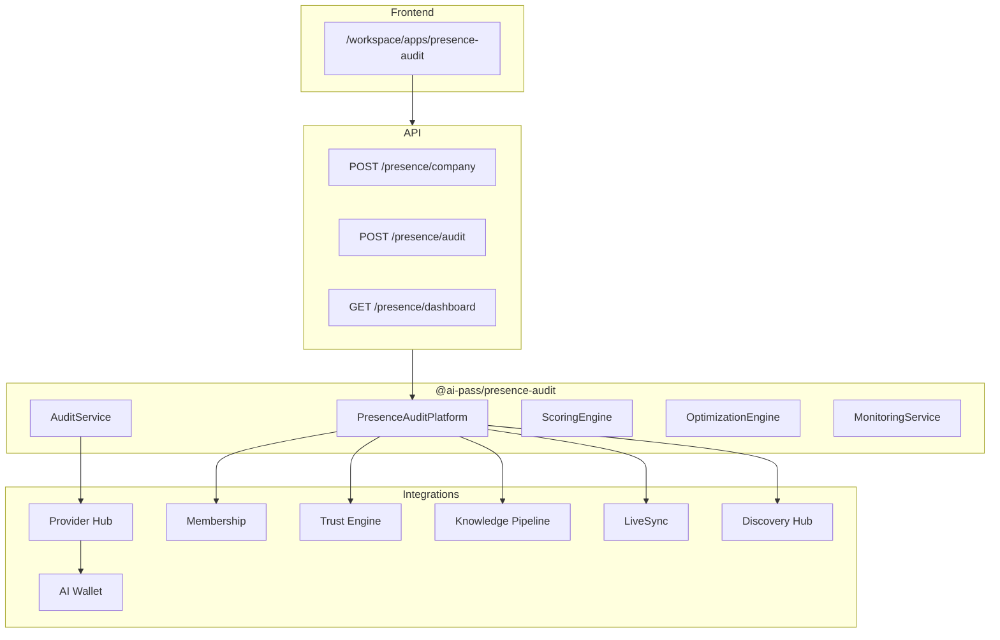

# Presence Audit — AI Visibility Intelligence Platform

AI-native visibility intelligence across **ChatGPT**, **Claude**, **Gemini**, and **Perplexity**. Not SEO — measure how AI systems recommend, rank, and represent your brand.

## Pipeline

```
Audit → Intelligence → Optimization → Monitoring
```

| Phase | Capability |
|-------|------------|
| **Audit** | Multi-provider queries via Provider Hub, full response capture, mention/ranking analysis |
| **Intelligence** | Scoring, representation analysis, competitor comparison, gap detection |
| **Optimization** | Playbook recommendations, prompt coverage, simulation mode |
| **Monitoring** | Scheduled audits, alerts, trend tracking, LiveSync triggers |

## Architecture



## Scoring Model

**AI Presence Score** (0–100) is the weighted average of five dimensions:

| Dimension | Weight | Description |
|-----------|--------|-------------|
| Visibility | 20% | % of provider responses mentioning the company |
| Recommendation | 20% | Visibility adjusted for competitor dominance |
| Ranking | 20% | Position when mentioned (lower rank = higher score) |
| Consistency | 20% | Cross-provider mention consistency |
| Accuracy | 20% | Penalized for hallucinations and outdated info |

## Optimization Playbook

Recommendations are generated from gap analysis across categories:

- Website & landing pages
- Structured data & schema.org
- Knowledge base, FAQ, docs
- External references, PR, directories
- Entity optimization & AI-ready content

Each recommendation includes impact level, estimated lift, action items, and trust risk annotation from Trust Engine.

## Membership Limits

| Plan | Audits/mo | Providers | Competitors | Monitoring | API |
|------|-----------|-----------|-------------|------------|-----|
| Free | 2 | 1 | 1 | — | — |
| Pro | 10 | 2 | 3 | — | — |
| Growth | 50 | 4 | 10 | ✓ | ✓ |
| Enterprise | ∞ | 4 | ∞ | ✓ | ✓ |

## API Routes

| Method | Route | Description |
|--------|-------|-------------|
| POST | `/api/v1/presence/company` | Create/update company profile |
| POST | `/api/v1/presence/audit` | Run multi-provider audit |
| POST | `/api/v1/presence/competitors` | Add competitor |
| POST | `/api/v1/presence/optimize` | Get recommendations / run simulation |
| GET | `/api/v1/presence/results` | Latest audit results |
| GET | `/api/v1/presence/dashboard` | Dashboard + analytics |
| GET | `/api/v1/presence/providers` | Provider catalog |
| GET | `/api/v1/presence/reports` | Generated reports |
| GET | `/api/v1/presence/history` | Audit history, alerts, events |

## Package Structure

```
packages/presence-audit/src/
  services/
    company-service.ts
    audit-service.ts
    provider-service.ts
    scoring-engine.ts
    competitor-service.ts
    optimization-engine.ts
    prompt-coverage.ts
    simulation-service.ts
    monitoring-service.ts
    reporting-service.ts
    analytics-service.ts
    presence-platform.ts
  provider-routing.ts   # Provider Hub integration
  membership-gates.ts
  trust.ts
  livesync.ts
  demo-data.ts
  api/
```

## Seed Data

Demo company **AI-Pass** with 3 competitors (LangChain, Vercel AI SDK, Microsoft Copilot Studio), audit results across 4 providers, score 72, 10 optimization recommendations, and monitoring alerts.

## Frontend

Workspace app at `/workspace/apps/presence-audit/` with pages: Dashboard, Company Setup, Competitors, Audit Results, Provider Comparison, Optimization Center, Monitoring, Reports, History, Administration.
