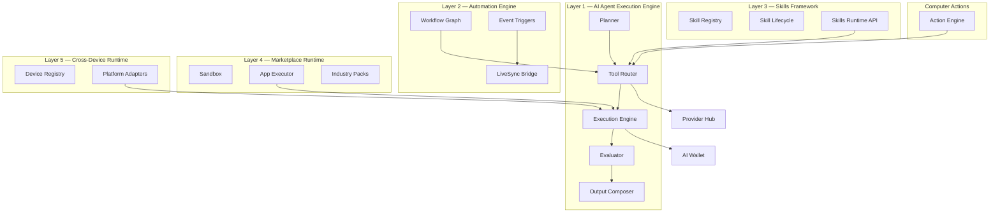

# AI-Pass Runtime Architecture

> Technical foundation all modules build upon — five runtime layers + computer actions.

See also: [Platform Architecture](./ARCHITECTURE.md) · [AI OS Overview](./AI-OS.md)

---

## Five Runtime Layers



**Package mapping**

| Layer | Package |
|-------|---------|
| 1 | `@ai-pass/runtime-core` |
| 2 | `@ai-pass/automation-engine` |
| 3 | `@ai-pass/marketplace-core` (`SkillsRuntimeService`) |
| 4 | `@ai-pass/marketplace-runtime` |
| 5 | `@ai-pass/device-runtime` |
| Actions | `@ai-pass/action-engine` |

---

## Execution Lifecycle

```
Input → Planning → Tool Routing → Execution → Evaluation → Structured Output
```

1. **Planner** (`generateExecutionPlan`) — infers tasks, skills, models, credit estimate
2. **Tool Router** (`routeTool`) — **all** execution routes through here; selects provider/model/skill/workflow
3. **Execution Engine** — modes: sequential, parallel, conditional, retry, fallback, timeout, approval, rollback
4. **Evaluator** — confidence, hallucination risk, policy, citations, completeness; low confidence → `NEEDS_INFO`
5. **Output Composer** — JSON, PDF stub, executive summary, business report, workflow result, decision, evidence

---

## Tool Router

Routing criteria: quality, latency, cost, membership tier, region, provider availability, fallback chain.

Integrates `@ai-pass/provider-hub` `RoutingEngine` — apps must not call providers directly.

---

## Skills Framework

Lifecycle: Register → Validate → Execute → Log → Version → Monitor

Skill types: parsing, OCR, reasoning, decision, email, slack, retrieval, RAG, voice, translation, API, automation, reporting, compliance, knowledge.

APIs: `GET/POST /api/v1/runtime/skills`

---

## Automation Engine

n8n-like graph: nodes + edges. Node types: condition, loop, wait, delay, retry, approval, notification, marketplace app, agent, external API.

Triggers: webhook, schedule, email, file upload, IoT stub, ERP, voice, marketplace, LiveSync.

---

## Marketplace Runtime

Apps execute inside `MockRuntimeSandbox` (production: isolated worker). `MarketplaceAppExecutor` wires `runtime-core` for app runs.

Industry packs (stubs): Invoice AI, Supply Chain AI, Customer Support AI, HR AI.

---

## Cross-Device Runtime

Device types: web, flutter, desktop, tablet, PWA, wearables stub, IoT stub, enterprise.

Adapters in `packages/device-runtime` wire `apps/web`, `apps/desktop`, `apps/mobile`.

---

## Computer Actions (OpenClaw-style)

`@ai-pass/action-engine` — sandbox actions with whitelist, approval, audit log, rollback, simulation mode, emergency stop.

Actions (stubs): browser automation, form fill, portal login, click, file upload/download, screenshot, desktop automation.

---

## Platform Integration

- `platform-core` `runtime-registry.ts` wires `runtime-core` into `ModuleRegistry`
- `WalletService.initializeNewUser()` — 5,000 free credits for new users
- `@ai-pass/auth-core` — Google, Microsoft, Email, SSO stubs
- `RuntimeMonitoringService` — credits, latency, providers, skills, workflows, marketplace, agents, confidence

---

## HTTP APIs

| Method | Path | Description |
|--------|------|-------------|
| POST | `/api/v1/runtime/plan` | Generate execution plan |
| POST | `/api/v1/runtime/execute` | Run plan through execution engine |
| GET | `/api/v1/runtime/skills` | List skills |
| POST | `/api/v1/runtime/skills` | Execute skill |
| GET | `/api/v1/runtime/providers` | Provider catalog + health |
| GET | `/api/v1/runtime/wallet` | Wallet summary |
| GET | `/api/v1/runtime/apps` | Apps + industry packs |
| GET | `/api/v1/runtime/metrics` | Runtime + LiveSync metrics |

---

## Consuming runtime-core (for module authors)

```typescript
import { getExecutionEngine, routeTool, getRuntimePlatform } from '@ai-pass/runtime-core';

// Always route tools through Tool Router
const decision = routeTool(task, { membershipTier: 'professional' });

// Plan + execute
const engine = getExecutionEngine();
const { plan } = engine.plan({ input: { goal: 'Validate invoice', userId, tenantId } });
const { execution } = await engine.execute({ plan });
```

Never call `@ai-pass/ai-core` or provider APIs directly from apps — use Provider Hub via Tool Router.

---

## Real vs Stubbed

| Component | Status |
|-----------|--------|
| Planner, Router, Executor, Evaluator, Output | **Real** (orchestration logic) |
| LLM inference | **Stub/demo** (needs API keys via Provider Hub) |
| Skill execution | **Mock** via `SkillLifecycleService.executeMock` |
| Automation visual editor | **Scaffold** (canvas layout, no drag-drop) |
| Action engine | **Simulation mode** by default |
| PDF output | **Stub** string |
| Industry packs (non-Invoice) | **Stub** |
| Wearables / IoT devices | **Stub** adapters |
| Auth providers | **Stub** redirect flows |
