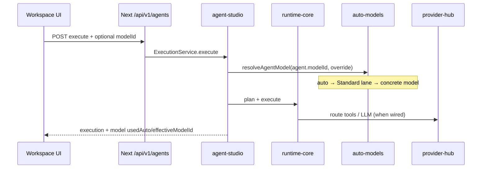
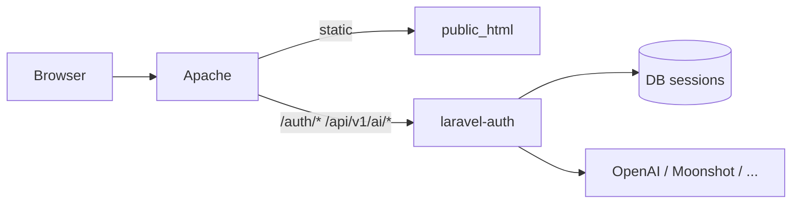

# AI-Pass Technical Overview

This document is the engineering entry point for the AI-Pass monorepo: what the system is, how packages fit together, and where execution and auth actually run.

Related: [Developer Guide](./DEVELOPER-GUIDE.md) · [Deployment](./DEPLOYMENT.md) · [Architecture](./ARCHITECTURE.md) · [Docs index](./README.md)

---

## 1. Product definition

AI-Pass is an **enterprise AI operating platform**, not only an IDE:

- **Workspace OS** (`/workspace`) — modules open inside one shell (sidebar + top bar).
- **Business builder** — requirements → solutions → deploy.
- **Agent Studio** — create, skill, execute, publish agents.
- **Model / Provider Hub** — multi-provider catalog, routing, membership gates.
- **Governance & Trust** — policies, approvals, certification.
- **Marketplace & Store** — skills and vertical apps (Invoice, Support, Supply Chain, …).
- **Auth & billing surface** — Laravel sessions + membership tiers + wallet credits.

---

## 2. Technology stack

| Layer | Choice |
|-------|--------|
| Language | TypeScript (apps + packages), PHP 8.4 (Laravel auth-api) |
| Monorepo | pnpm workspaces + Turbo |
| Web app | Next.js (App Router), React 19, static export for production |
| UI | `@ai-pass/ui` workspace theme (dark OS chrome) |
| Auth API | Laravel 11 + Socialite (Google), session cookies |
| AI calls | OpenAI-compatible HTTP (+ Anthropic native path) via Provider Hub / Laravel `AiProviderService` |
| Hosting | Hostinger: `public_html` (static) + `laravel-auth` (API), Apache `.htaccess` proxies |

**Node:** ≥ 20 · **pnpm:** 9.x

---

## 3. Repository layout

```text
ai-pass/
├── apps/
│   ├── web/                 # Next.js — marketing + /workspace + /ide
│   ├── desktop/             # Electron shell (legacy / companion)
│   └── mobile/              # Mobile client
├── packages/                # Domain libraries (@ai-pass/*)
├── services/
│   └── auth-api/            # Laravel — auth, /auth/me, /api/v1/ai/*
├── php-auth/                # Legacy PHP auth (superseded by Laravel)
├── scripts/                 # build-web-static, deploy-ftp, Laravel deploy
├── docs/                    # This documentation set
├── pnpm-workspace.yaml
├── turbo.json
└── package.json
```

Packages are published only inside the workspace (`"private": true`). Web depends on them via `"@ai-pass/...": "workspace:*"`.

---

## 4. Architectural rules

### 4.1 Single AI execution path

```text
UI / Agent / Vertical
        → runtime-core (plan / tools / execute)
        → provider-hub (catalog, route, health)
        → ai-core or Laravel AiProviderService
        → wallet (credits / usage)
```

Do **not** call OpenAI/Anthropic/Gemini SDKs from `apps/web` page code.

### 4.2 Module registry

Workspace modules are declared in `@ai-pass/platform-core` (`PLATFORM_MODULE_DEFS` / navigation). Each module has `id`, `route`, `tier`, `status`, `permissions`, `navOrder`.

### 4.3 Membership ≠ RBAC

| Concern | Package / system |
|---------|------------------|
| Billing plan (free/pro/power/enterprise) | `@ai-pass/membership` |
| Model free list / tier gates | `config/ai.php` + membership |
| Agent Auto model lanes | `@ai-pass/agent-studio` `auto-models` |
| AI-system governance | `@ai-pass/governance` |

---

## 5. Runtime data flow (agent execute)



See [Auto models](./AUTO-MODELS.md) and [Agent Studio](./AGENT-STUDIO.md).

---

## 6. Auth & AI proxy (production)



| Path | Handler |
|------|---------|
| `/`, `/workspace/*`, `/_next/*` | Static Next export |
| `/auth/*` | Laravel (login, Google OAuth, `/auth/me`) |
| `/api/v1/ai/models`, `/api/v1/ai/chat` | Laravel `AiProviderService` (session auth) |

Details: [Laravel Auth](./LARAVEL-AUTH.md), [Deploy Auth](./DEPLOY-AUTH.md).

---

## 7. Package map (selected)

### Core platform

| Package | Responsibility |
|---------|----------------|
| `platform-core` | Modules, nav, org stubs, workspace context |
| `provider-hub` | Provider definitions, model catalog, routing |
| `ai-core` | Low-level chat/completion adapters |
| `membership` | Plans, entitlements, feature gates |
| `wallet` | Credits and usage |
| `auth-core` | Client auth types / config stubs |
| `ui` | Shared React components + workspace theme |
| `shared` | Cross-cutting types |

### Agents & automation

| Package | Responsibility |
|---------|----------------|
| `agent-studio` | Agents, skills, workflows, execution, **auto-models** |
| `agent` | IDE agent loop / tools |
| `runtime-core` | Planner, tool router, execution engine |
| `automation-engine` | Workflow graphs |
| `livesync` | Live orchestration |
| `mcp` | MCP server integration stubs |

### Knowledge, trust, governance

| Package | Responsibility |
|---------|----------------|
| `knowledge-pipeline` | RAG / collections |
| `governance` | AI governance control plane |
| `trust` / `trust-engine` | Trust scoring |
| `compliance-ai` | Compliance vertical |

### Marketplace & verticals

| Package | Responsibility |
|---------|----------------|
| `marketplace*` / `store*` | Skills + store |
| `invoice-ai`, `supply-chain-ai`, `customer-support-ai`, `sales-ai`, `content-ai` | Vertical products |
| `presence-audit` | LLM brand presence |
| `erp-connectors` / `crm-connectors` | Enterprise connectors |

---

## 8. Apps

### `apps/web`

- Marketing site + downloads
- `/workspace/*` — platform OS
- `/ide` — in-browser IDE (Monaco, chat, agent)
- Static export via `scripts/build-web-static.sh`

### `apps/desktop` / `apps/mobile`

Companion clients; desktop may wrap or deep-link into the web workspace depending on release channel.

### `services/auth-api`

Laravel application: users, sessions, Google OAuth, AI model list + chat proxy, free-tier limits.

---

## 9. Configuration surfaces

| Config | Purpose |
|--------|---------|
| `services/auth-api/config/ai.php` | Provider keys, model catalog, free_model_ids, endpoints |
| `services/auth-api/.env` | Secrets (never commit) |
| `@ai-pass/membership` plans | Feature matrix |
| `@ai-pass/agent-studio` auto-models | Standard/Premium/Frontier lanes + access policy |
| `packages/platform-core` modules | Nav + module metadata |

---

## 10. Security notes

- Provider API keys stay **server-side** (Laravel `.env` / managed secrets).
- Browser uses session cookies for `/auth/me` and AI proxy.
- SCIM / workspace RBAC (when enabled) assign capabilities via **groups**, not per-user permission sprawl.
- Rotate any key that has appeared in chat logs or tickets.

---

## 11. Related deep dives

- [Runtime Architecture](./RUNTIME-ARCHITECTURE.md)
- [MULTI-AI-SETUP](./MULTI-AI-SETUP.md)
- [AGENT-STUDIO](./AGENT-STUDIO.md)
- [AI-GOVERNANCE](./AI-GOVERNANCE.md)
- [UNIVERSAL-MEMBERSHIP](./UNIVERSAL-MEMBERSHIP.md)
- [API](./API.md)
