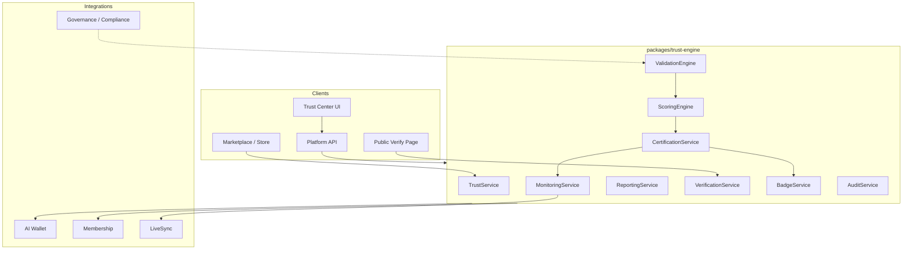

# AI-Pass Trust Engine

Enterprise trust and certification layer for AI systems — TÜV + ISO + SOC for AI.

## Architecture



## Services

| Service | Responsibility |
|---------|----------------|
| **TrustService** | AI system registry (agents, apps, models, workflows, marketplace apps) |
| **ValidationEngine** | Functional, reliability, explainability, compliance, safety, performance, hallucination, multi-model, edge case, adversarial (structured stubs) |
| **ScoringEngine** | Dimension scores, overall trust score 0–100, risk score, certification recommendation |
| **CertificationService** | Bronze / Silver / Gold / Platinum levels with controls, monitoring, renewal policy |
| **MonitoringService** | Hallucination rate, drift, reliability, policy violations, model/provider changes |
| **ReportingService** | Executive, technical, risk, compliance reports; PDF/JSON/HTML/CSV export stubs |
| **VerificationService** | Public verification by ID |
| **BadgeService** | AI-Pass Certified badge (SVG stub, QR metadata, embed codes) |
| **AuditService** | Immutable audit logs with integrity hashes |

## Scoring Model

Overall trust score is a weighted sum of five dimensions:

| Dimension | Default weight |
|-----------|----------------|
| Functional | 30% |
| Reliability | 20% |
| Explainability | 15% |
| Compliance | 20% |
| Safety | 15% |

High-risk domains increase compliance weight to 25%. Risk score is `100 - overall` with adjustments for high-risk domains and low safety.

## Certification Levels

| Level | Min overall | Duration | Monitoring interval |
|-------|-------------|----------|---------------------|
| Bronze | 65 | 6 months | Weekly |
| Silver | 75 (+ reliability, explainability) | 9 months | Every 3 days |
| Gold | 85 (+ reliability, compliance, safety) | 12 months | Daily |
| Platinum | 92 (+ all dimensions ≥85) | 12 months | Every 6 hours |

## API Routes

| Method | Path | Description |
|--------|------|-------------|
| POST | `/api/v1/trust/validate` | Run validation |
| POST | `/api/v1/trust/certify` | Issue certification |
| GET | `/api/v1/trust/systems` | List AI systems |
| GET | `/api/v1/trust/reports` | List reports |
| GET | `/api/v1/trust/verification/:id` | Public verification |
| GET | `/api/v1/trust/monitoring` | Monitoring events |
| GET | `/api/v1/trust/dashboard` | Dashboard KPIs |
| POST | `/api/v1/trust/testsuite` | Register test suite |

## Verification Flow

1. System registered in **TrustService**
2. **ValidationEngine** runs test scenarios across dimensions
3. **ScoringEngine** computes trust score and recommended level
4. **CertificationService** issues cert with verification ID (`AIP-XXXXXXXX`)
5. **BadgeService** generates embeddable badge
6. Public page at `/verify/{id}` shows status: Active / Expired / Revoked / Under Review

## Badge Spec

- SVG shield with level color (Bronze `#CD7F32`, Silver `#C0C0C0`, Gold `#FFD700`, Platinum `#E5E4E2`)
- QR metadata links to `https://ai-pass.com/verify/{verificationId}`
- Embed codes: HTML ``, Markdown badge link, iframe widget

## Frontend Routes

| Route | Description |
|-------|-------------|
| `/workspace/trust` | Trust Dashboard |
| `/workspace/trust/certify` | 5-step Certification Wizard |
| `/workspace/trust/systems/[id]` | AI System Details |
| `/workspace/trust/runs` | Validation Runs |
| `/workspace/trust/monitoring` | Monitoring Dashboard |
| `/workspace/trust/reports` | Reports |
| `/workspace/trust/badges` | Badge Management |
| `/workspace/trust/admin` | Administration |
| `/workspace/trust/tests` | Test Scenario Builder |
| `/verify/[id]` | Public verification (no auth) |

## Integrations

- **marketplace-core / store / discovery-hub**: `getTrustSummaryForResource()` + `TrustCertBadge` component
- **AI Wallet**: validation, certification, monitoring, reports consume credits
- **Membership**: tier limits for validations/month, monitoring tier, max cert level
- **LiveSync**: `trust.validation`, `trust.certification`, `trust.monitoring_alert` events
- **Governance**: ISO 42001, 27001, SOC2, GDPR, NIS2, DORA framework stubs in risk assessment

## Seed Data

- 5 certified apps: Invoice AI, Supply Chain AI, HR AI, Presence Audit, Compliance AI
- 3 validation runs
- 2 expiring certifications (HR AI, Presence Audit)
- Monitoring alerts (hallucination, drift)

## Usage

```typescript
import { getTrustEngine } from '@ai-pass/trust-engine';

const engine = getTrustEngine();
const dashboard = engine.getDashboard();
const record = engine.verification.verify('AIP-INV2026');
```
